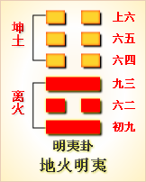

---
hide:
  - navigation
---
# 周易第6卦_讼卦(天水讼)_乾上坎下 

<table>
	<tbody>
		<tr>
			<td class="td1">
				</td>
			<td class="td1">
				</td>
			<td class="td1">
				</td>
			<td class="td1">
				</td>
		</tr>
		<tr>
			<td style="text-align: center;">
				<strong>本卦</strong></td>
			<td style="text-align: center;">
				<strong>互卦</strong></td>
			<td style="text-align: center;">
				<strong>错卦</strong></td>
			<td style="text-align: center;">
				<strong>综卦</strong></td>
		</tr>
		<tr>
			<td style="text-align: center;">
				<a href="" style="text-decoration: none;">第6卦：讼卦(天水讼)</a></td>
			<td style="text-align: center;">
				<a href="../37.风火家人" style="text-decoration: none;">第37卦：家人卦(风火家人)</a></td>
			<td style="text-align: center;">
				<a href="../36.地火明夷" style="text-decoration: none;">第36卦：明夷卦(地火明夷)</a></td>
			<td style="text-align: center;">
				<a href="../05.水天需" style="text-decoration: none;">第5卦：需卦(水天需)</a></td>
		</tr>
	</tbody>
</table>

## 周易第六卦详解

**讼卦原文**

讼。有孚，窒惕，中吉，终凶。利见大人，不利涉大川。

象曰：天与水违行，讼。君子以做事谋始。

**白话文解释**

讼卦：虽有利可图(获得俘虏)，但要警惕戒惧。其事中间吉利，后来凶险。占筮得此爻，有利于会见贵族王公，不利于涉水渡河。

《象辞》说：上卦为乾，乾为天；下卦为坎，坎为水，天水隔绝，流向相背，事理乖舛，这是讼卦的卦象。君子观此卦象，以杜绝争讼为意，从而在谋事之初必须慎之又慎。

**《断易天机》解**

讼卦乾上坎下，为离宫游魂卦。上乾为刚，下坎为险，一方刚强，一方阴险，必然产生争论，因此多有不吉。

**北宋易学家邵雍解**

天高水深，达远不亲；慎谋退守，敬畏无凶。

得此卦者，身心不安，事多不顺，与他人多争诉之事，宜修身养性，谨慎处事。

**台湾国学大儒傅佩荣解**

时运：功名受阻，不宜树敌。

财运：开始谨慎，终可获利。

家宅：君子必求淑女。

身体：预防胜于治疗。

**传统解卦**

这个卦是异卦（下坎上乾）相叠。同需卦相反，互为“综卦”。乾为刚健，坎为险陷。刚与险，健与险，彼此反对，定生争讼。争讼非善事，务必慎重戒惧。

大象：乾天升于上，坎水降于下，相背而行而起讼。

运势：事与愿违，凡事不顺，小人加害，宜防陷阱。

事业：起初顺利，有利可图，继而受挫，务必警惕，慎之又慎，不得固执已见，极力避免介入诉讼纠纷的争执之中。与其这样，不如退而让人，求得化解，安于正理，可免除意外之灾。陷入争讼，即使获胜，最后还得失去，得不偿失。

经商：和气生财，吃亏是福，切勿追求不义之财。商业谈判应坚持公正、公平、互利的原则，尽量避免发生冲突。这样便会有好结果。

求名：不利。自己尚缺乏竞争实力，应坚守纯正，隐忍自励，自强自勉，切莫逞强。依靠有地位的人的帮助，及早渡过难关。

婚恋：虽不尽人意，倒也般配，彼此理解，未尝不可。双方应以温和的方式处理生活。

决策：争强好胜，不安于现状，为改变命运和超越他人而奋斗。头脑聪颖，反应敏捷，有贵人相助。但缺乏持之以恒的毅力，容易露出锋芒，得罪他人，带来诉讼之灾。宜承认现实，顺其自然，知足，适可而止。接受教训，引以为戒，可功成名就。

**第六卦哲学含义**

讼卦，这个卦是异卦相叠，下卦为坎，上卦为乾。乾为刚健，坎为险陷。刚与险，健与陷，彼此反对，定生争讼。争讼非善事，务必慎重戒惧。

讼卦位于需卦之后，同需卦相反，互为“综卦”。《序卦》之中这样说道：“饮食必有讼，故受之以讼。”人与人之间因为争取需求而发生诉讼。

《象》曰：天与水违行，讼;君子以作事谋始。

讼卦上卦为乾为天为阳，其性质向上，下卦为坎为水为阳，其性质向下，两卦同性相斥，并且天往上升，水往下流，目标相违背，这便是讼卦的卦象。这就好比人们各自怀着私心，都为自己的利益着想，思想不能统一起来。所以人们在争夺利益的同时，便会引发争斗，到头来只有通过沂讼进行解决了。

讼卦之象，有口舌二字，为祸端起因;山下有睡虎，主有惊恐;文书在云中，主远而未兴讼;人立虎下，主到尾有惊。占者若得之，宜慎出入。此为俊鹰逐兔之卦。

## 周易第六卦初九爻详解

**初六爻辞**

初六。不永所事，小有言，终吉。

象曰：不永所事，讼不可长也；虽小有言，其辩明也。

**白话文解释**

初六：做事不能持之以恒，稍有过错，最后还是吉利的。

《象辞》说：做事不能持之以恒，说明官司不可能长久打下去。虽然稍有过错，但争讼双方的是非曲直终将辨别清楚。

**北宋易学家邵雍解**

吉：得此爻者，会生起是非，但终吉。有病者，不药而愈。做官的会遭诽谤，但会不辩自明。

**台湾国学大儒傅佩荣解**

时运：不会久困，终可出名。

财运：及时售出，口舌无碍。

家宅：有些争议，分辨明白即可。

身体：初病可愈，久病则凶。

**初六变卦**

初六爻动变得周易第10卦：天泽履。这个卦是异卦（下兑上乾）相叠，乾为天，兑为泽，以天喻君，以泽喻民，原文：“履（踩）虎尾，不咥（咬）人”。因此，结果吉利。君上民下，各得其位。兑柔遇乾刚，所履危。履意为实践，卦义是脚踏实地的向前进取的意思。

**初九爻的哲学含义**

讼卦代表争端，初六可谓是开始阶段，阴爻居于柔位，顺从的性格表示其不会把这种争讼之事长久地进行下去，可能会小有一些口舌之争，但是最后会吉祥。

占得此爻的人，应该学习一下蔺相如的做法。人与人之间发生矛盾，这是难免的。矛盾发生后，按此爻爻义所示，最好的办法是尽快消解矛盾，达到和解，使斗争结束于“有言”的状态，而不宜将斗争扩大和继续下去。

占得此爻的人，别人说一句错话、办了一件错事，偶而说说可以，只有这样才能吉祥，不要一直纠缠不放，否则会惹出事端。

占得讼卦的人，因为讼卦的内卦为坎，喻指此人存在着自负的性格，虽然有与人合作的愿望，但往往傲慢不恭，好为人师，从而引发争端。占得此爻，要注意克制一下自己。

## 周易第六卦九二爻详解

**九二爻辞**

九二。不克讼，归而逋，其邑人三百户无眚。

象曰：不克讼，归而逋也；自下讼上，患至掇也。

**白话文解释**

九二：讼事失败，归到采邑，三百户奴隶逃亡。没有大的灾祸。

《象辞》说：讼事失败，逃窜回家，这是躲避反讼。小官与大官争讼，败讼而归，势在必然。幸好灾难没有进一步扩大。

**北宋易学家邵雍解**

平：得此爻者，平安无事。做官的会有食邑之荣。

**台湾国学大儒傅佩荣解**

时运：退而隐居，可保无害。

财运：小有耗损，不必多虑。

家宅：不宜婚嫁。

身体：在外染病，回家调养。

**九二变卦**

九二爻动变得周易第12卦：天地否。这个卦是异卦（下坤上乾）相叠，其结构同泰卦相反，系阳气上升，阴气下降，天地不交，万物不通。它们彼此为“综卦”，表明泰极而否，否极泰来，互为因果。

**九二爻的哲学含义**

讼卦第二爻爻辞释义

克：胜也。“克讼”类似于胜诉的意思。逋：逃。眚：自身原因造成的祸

邑：是大夫的封地。三百邑是下大夫的领地。

本爻的意思是：争讼没有成功，回来躲避，其采邑的三百户人口没有灾害。

从卦象上看，九二属于阳爻居于阴位，虽然失位，但是得中。在本卦之中，

只有九二与九五为阳爻，九五以阳爻居阳位，是尊位、大人位，居君位而中正，九二却居于下卦的第二爻，身份地位明显低于九五。九二与九五是敌应关系，两方因某事发生了争讼。九二当然不是九五的敌手，但是其自恃己见，以为不管对方势力多大，官位多高，只要自己有理，就可以争讼一番。但要知道，下不能犯上，地不能逼天。九五为尊，九二与九五“叫板”，属于以下犯上，在当时的集权制的社会中，这是自取祸患，明显地打不赢这场官司的。

根据卦像来看，下卦为坎，坎代表着危险，而九二正处于坎卦正中，处于危险之中，所以官司对其不利。好在九二认清了形势，没有一直敌对下去，而是选择了躲避，逃回了家乡，这样勉强没事，并且邑人也没有受到牵连。

占得本爻的人，若是正在争讼之中，要看清形势，若是形势对自己不利，对方占有明显的优势，就要先采取躲避的办法以免灾祸。可以找一处休闲地方散散心，暂避几日，是非便会不争自散。所以此爻主要告知人们的就是：适时地躲避。

## 周易第六卦九三爻详解详解

**六三爻辞**

六三。食旧德，贞厉，终吉。或从王事，无成。

象曰：食旧德，从上吉也。

**白话文解释**

六三：依赖先人遗业过活。卜问得险兆，但最后是吉利的。但是，如果服务于王事，谋取利禄，却不会成功。

《象辞》说：依赖先人遗业过活，因为六三爻象表明，居于九四之下，只有凭借祖上余荫才获吉利。

**北宋易学家邵雍解**

平：得此爻者，宜保持常态，则无灾难。做官的宜谨守常职，晋升无望。

**台湾国学大儒傅佩荣解**

时运：谨守旧业，求仕无成。

财运：固守家产，终可得利。

家宅：不宜另建新居。

身体：按原医师指示为宜。

**六三变卦**

六三爻动变得周易第44卦：天风姤。这个卦是异卦（下巽上乾）相叠。乾为天，巽为风。天下有风，吹遍大地，阴阳交合，万物茂盛。姤（gǒu）卦与夬卦相反，互为“综卦”。姤即媾，阴阳相遇。但五阳一阴，不能长久相处。

**九三爻的哲学含义**

食：饮食之意，引申为喜好、保持。

旧德：指自己原有的功德，一种祖先留下的功德。“食旧德”是指保持旧有的功德，或者是指享用祖先的余荫，也就是“吃老本”之意。

这句爻辞有两种解释：一是指享用祖先的余荫，守住正固，会有危险，最后吉祥，或者跟君王做事，没有成就，二是指安享旧有俸禄，守正道，虽然占卜遇到危险的兆头，最终也是吉利的，即使为国家君王立下大功，也不自居其成。

占得此爻者，还要注意不可长久地吃老本，这种老本可能是指祖辈留下的财产或是功德，也可能是指你过去的人脉关系，应该认真地看一下当前的形势，严格地要求自己，在维持过去的财产和人脉关系的同时，还要去开创新的事业，建立新的人脉关系。

六三爻与世无争，可以靠祖宗留下的余荫生活，不与人争，自然吉祥了。六三爻与上九爻相应，上九为宗庙之位，所以有六三受益于宗庙的卦象。

## 周易第六卦九四爻详解详解

**九四爻辞**

九四。不克讼，复即命，渝安贞，吉。

象曰：复即命，渝安贞，吉，不失也。

**白话文解释**

九四：讼事失败，败讼回家，服从判决。卜问平安，得吉利之兆。

《象辞》说：败讼回家，服从判决，安守本分，不失正道。

**北宋易学家邵雍解**

吉：得此爻者，会转危为安。做官的会闲中复职。

**台湾国学大儒傅佩荣解**

时运：转危为安。

财运：合作不成，反是好事。

家宅：改婚不失其道。

身体：有凶险，改变生活方式则吉。

**九四变卦**

九四爻动变得周易第59卦：风水涣。这个卦是异卦（下坎上巽）相叠。风在水上行，推波助澜，四方流溢。涣，水流流散之意。象征组织和人心涣散，必须用积极的手段和方法克服，战胜弊端，挽救涣散，转危为安。

**九四爻的哲学含义**

复：指恢复。命：有命运的含义。“复即命”，恢复到原来的命运状态。

渝：指改变。

本爻的爻义是指：争讼没有成功，返回到自己原来的状态，安于现状，坚守正道，吉祥。

从卦象上看，九四已经进入上卦，并且属于刚爻居于阴位，失位且不居中，过于刚健好胜，不得人心。九四明白自己的过错之后，改变与人好争的性格，从而获得吉祥。

占得此爻者，在争执、官司上不能胜诉。当出现这种结果时，虽然心里可能觉得不满意，甚至不服气，怒心冲冲，但是，要克制一下自己，接受这种结果。回归到正常的生活轨道上，不要再因为官司或争执而耽误了正常的生活和工作，也不要为了发泄不满做出伤害他人的举动，不要想着去报复对方，应接受法律的判决，并认为这都是命运的安排，回到家继续自己以前的生活，这样才能吉祥。

## 周易第六卦九五爻详解详解

**九五爻辞**

九五。讼，元吉。

象曰：讼，元吉，以中正也。

**白话文解释**

九五：争讼，筮遇此爻，大吉大利。

《象辞》说：争讼而大吉大利，因为九五之爻居上卦的中位，像人守中正之道。

**北宋易学家邵雍解**

吉：得此爻者，经营、谋事、求财皆大吉。做官的会受到重用。读书人会获得佳绩。

**台湾国学大儒傅佩荣解**

时运：以正求进，必可大显。

财运：公平经营，取得正财。

家宅：与富贵人结婚。

身体：吐纳之术保健康。

**九五变卦**

九五爻动变得周易第64卦：火水未济。这个卦是异卦（下坎上离）相叠。离为火，坎为水。火上水下，火势压倒水势，救火大功未成，故称未济。《周易》以乾坤二卦为始，以既济、未济二卦为终，充分反映了变化发展的思想。

**九五爻的哲学含义**

讼卦第五爻爻辞释义元吉：大吉。

本爻的爻义是：官司得到了公正的判决，大吉。

此爻是讼卦的第五爻，占得此爻的人，若是打官司，必大获全胜。胜诉的原因是遇到了公正的法官，幸逢贵人。在讼卦之中，九五这一爻属于阳爻居刚位，正是得位，这表示大人得位，以公正严明的态度处理诉讼。所以，官司会得到公正的解决。可见，官司若能得到公正的解决，除了你要有理之外，还在于遇到的法官是否公正。包公为秦香莲伸张正义，怒斩陈世美的故事，正是此爻爻义所在。

## 周易第六卦上九爻详解详解

**上九爻辞**

上九。或锡之鞶带，终朝三褫之。

象曰：以讼受服，亦不足敬也。

**白话文解释**

上九：王侯赐予人以绅带，但不满一天，三次赐予三次革夺。

《象辞》说：某人因为讼事而得到赐予绅带的殊荣，这不是值得尊敬的事。

**北宋易学家邵雍解**

平：得此爻者，会有争诉之忧，宜修德养身，化大为小。做官的会有成有败，患得患失。读书人认真学习，必可获佳绩。

**台湾国学大儒傅佩荣解**

时运：患得患失，殊为不值。

财运：不是正财，得不偿失。

家宅：不易安居。

身体：病势时好时坏，恐凶。

**上九变卦**

上九爻动变得周易第47卦：泽水困。这个卦是异卦（下坎上兑）相叠。兑为阴为泽喻悦；坎为阳为水喻险。泽水困，陷入困境，才智难以施展，仍坚守正道，自得其乐，必可成事，摆脱困境。

**上九爻的哲学含义**

讼卦第六爻爻辞释义

锡：同“赐”，赐给。鞶带：大带，古代官服的一部分。褫：指剥去衣服。本爻的爻义是：或许受赐官服大带，但是一天之内被多次剥夺。

我们的文化讲求的是“忍为贵，和为高”，占得此卦者，可能因为爱打官司，恃强争讼，结果得到了一定的好处，包括得到了升官的机会，穿上了官服，扎了大带，但是，这种做法因为违背了传统的文化而受到舆论的谴责，通过这种方式得官在别人看来也是不光彩的。由于大家对你的评价不好，会影响上级对你的印像，你的官职可能是保不住的，甚至一天之内可能多次被剥掉官服，也就是被多次免职，职位不稳，非常危险。

占得此爻者，当心有关换房、租房、提升、加薪等事，可能遭到三番五次的戏弄。当然，你要注意，不要对别人出尔反尔，不要戏弄别人。