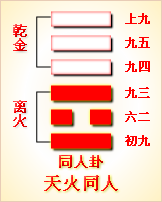

---
hide:
  - navigation
---
# 周易第7卦_师卦(地水师)_坤上坎下 

<table>
	<tbody>
		<tr>
			<td class="td1">
				</td>
			<td class="td1">
				</td>
			<td class="td1">
				</td>
			<td class="td1">
				</td>
		</tr>
		<tr>
			<td style="text-align: center;">
				<strong>本卦</strong></td>
			<td style="text-align: center;">
				<strong>互卦</strong></td>
			<td style="text-align: center;">
				<strong>错卦</strong></td>
			<td style="text-align: center;">
				<strong>综卦</strong></td>
		</tr>
		<tr>
			<td style="text-align: center;">
				<a href="" style="text-decoration: none;">第7卦：师卦(地水师)</a></td>
			<td style="text-align: center;">
				<a href="../24.地雷复" style="text-decoration: none;">第24卦：复卦(地雷复)</a></td>
			<td style="text-align: center;">
				<a href="../13.天火同人" style="text-decoration: none;">第13卦：同人卦(天火同人)</a></td>
			<td style="text-align: center;">
				<a href="../08.水地比" style="text-decoration: none;">第8卦：比卦(水地比)</a></td>
		</tr>
	</tbody>
</table>

## 周易第七卦详解

**师卦原文**

师。贞，丈人吉，无咎。

象曰：地中有水，师。君子以容民畜众。

**白话文解释**

师卦：占问总指挥的军情，没有灾祸。

《象辞》说：下卦为坎，坎为水；上卦为坤，坤为地，像“地中有水”，这是师卦的卦象。君子观此卦象，取法于容纳江河的大地，收容和畜养大众。

**《断易天机》解**

师卦坤上坎下，为坎宫归魂卦。师即兵众，只有选择德高望重的长者来统率军队，才能吉祥无咎。

**北宋易学家邵雍解**

忧劳动众，变化无穷；公正无私，排除万难。

得此卦者，困难重重，忧心劳众，宜包容别人，艰苦努力，摒除一切困难。

**台湾国学大儒傅佩荣解**

时运：包容别人，修行待时。

财运：有财有库，善自珍惜。

家宅：旧亲联姻，可喜可贺。

身体：腹胀之症，调气无忧。

**传统解卦**

这个卦是异卦（下坎上坤）相叠。“师”指军队。坎为水、为险；坤为地、为顺，喻寓兵于农。兵凶战危，用兵乃圣人不得已而为之，但它可以顺利无阻碍地解决矛盾，因为顺乎形势，师出有名，故能化凶为吉。

大象：养兵聚众，出师攻伐之象，彼此有伤，难得安宁。

运势：困难重重，凡事以正规行事，忌独断独行、投机取巧，提防潜在敌人。

事业：阻力很大，困难很多，处于激烈的竞争状态，要与他人密切合作，谨小慎微，行为果断，切忌盲目妄动，适度即可，注意保全自己。机动灵活，严于律已。从容沉着对付一切，必能成功。

经商：已有一定的积蓄，可以从事大的营销活动，但必卷入激烈商战，以刚毅顽强的精神和高尚的商业道德，辅以灵活的方法，勿贪图小利，勿掉以轻心，加强与他人的沟通，必可摆脱困境，化险为夷。

求名：具备很好的条件，但须有正确的引导，务必严格要求自己，克服不利因素的干扰，经过扎实努力，必可名利双全。

婚恋：慎重、专注，否则会陷入“三角”纠纷。痴情追求可以达到目的。

决策：天资聪颖，性格灵活，具有坚强的意志，对事业执着追求，迎难而进。可成就大事业。喜竞争，善争辩，富有冒险精神，不免带来麻烦，务老成持重，不贪功，以中正为要。

**第七卦的哲学含义**

师卦，此卦是异卦相叠，下卦为坎，上卦为坤。“师”指军队。坎为水、为险；坤为地、为顺，喻寓兵于农。兵凶战危，用兵乃圣人不得已而为之，但它可以顺利无阻碍地解决矛盾，因为顺乎形势，师出有名，故能化凶为吉。占得此卦，对于军事上率师出征非常有利，必无灾祸。师卦是天马出群之卦，以寡伏众之象。

师卦位于讼卦之后，《序卦》之中这样解释道：“讼必有众起，故受之以师。师者，众也。”争讼的人越来越多，以致形成了军队。

《象》中这样解释师卦：师卦的形象，下卦“坎”为险，水；上卦“坤”为地，顺。整个卦象就是地下有水。水潜藏在地下取之不尽，也就是士兵来源于农民中间。因而，这一卦象征“师”。君子观此象，应当效法这一精神，平素能容民养民如大地蓄水。在人民当中蓄积兵众的力量，以备战时用之不竭。

师卦之象：有虎、马、牛指寅午未;将军立于台上，主掌兵权;执印者拜于地，指受赏。天马出群之卦，以寡服众象。

## 周易第七卦初九爻详解

**初六爻辞**

初六。师出以律，否臧凶。

象曰：师出以律，失律凶也。

**白话文解释**

初六：整军出战全凭纪律，不遵守纪律就会有凶险。

《象辞》说：整军出战全凭纪律，失去纪律的约束就会带来凶险。

**北宋易学家邵雍解**

凶：得此爻者，经营得当，则财货日增。但妄动者，成少败多。不良者，多险难刑伤。做官的宜谨守正道，则会得到上级的欣赏。

**台湾国学大儒傅佩荣解**

时运：失道以求，终受其辱。

财运：海运业务，合义则吉。

家宅：治家以法，否则必凶。

身体：寒多热少，宜早医治。

**初六变卦**

初六爻动变得周易第19卦：地泽临。这个卦是异卦（下兑上坤）相叠。坤为地，兑为泽，地高于泽，泽容于地。喻君主亲临天下，治国安邦，上下融洽。

**初九爻的哲学含义**

师卦第一爻爻辞释义

律：军纪，纪律。否(仏)臧(巧叩):不好。这里指不守军纪。

本爻爻辞的意思是：出师征战必须要有严明的纪律，如果军纪混乱必然有凶

从卦象上看，初六属于阴爻居于阳位，又处于下卦坎之中，像才质柔弱、能力很差而不又归正的基层小兵一样。对于这样的小兵，必须严明军纪，严加管束，否则整个军队就会像一盘散沙，没有战斗力。

占得此卦者，如果自己是老板或领导的话，一定要注意严明纪律，人好不如制度好，如果对一切行为活动都制定了准则，并严格按此来执行，那么部下的工作就会井井有条。一定要对下面的人严格约束，不然公司或单位将面临危险。

## 周易第七卦九二爻详解

**九二爻辞**

九二。在师中，吉无咎，王三锡命。

象曰：在师中吉，承天宠也，王三锡命，怀万邦也。

**白话文解释**

九二：主帅身在军中指挥，吉利，没有灾难。君王三次颁命嘉奖。

《象辞》说：主帅身在军中指挥，吉利，因为得到上天的宠爱。君王三次颁命嘉奖，因为主帅能怀徕万国。

**北宋易学家邵雍解**

吉：得此爻者，会遇到贵人，谋事可成。做官的会受到上级的赏识，有升迁之机会。读书人会取得佳绩。

**台湾国学大儒傅佩荣解**

时运：杰出人才，大受赏识。

财运：谋略出众，领导获利。

家宅：邻里所重；婚姻吉祥。

身体：流动血气，病即舒解。

**九二变卦**

九二爻动变得周易第2卦：坤为地。这个卦是同卦（下坤上坤）相叠，阴性。象征地（与乾卦相反），顺从天，承载万物，伸展无穷无尽。坤卦以雌马为象征，表明地道生育抚养万物，而又依天顺时，性情温顺。它以“先迷后得”证明“坤”顺从“乾”，依随“乾”，才能把握正确方向，遵循正道，获取吉利。

**九二爻的哲学含义**

王：君王。锡命：赐命，意思是下令嘉奖。

本爻的爻义是：在军中任统帅，持中不偏可得吉祥，不会有什么灾祸;君王多次赐命嘉奖。

从卦象上看，九二居下卦中位，九二与六五正应，六五为天位或天子位，对九二全力支持，所以会嘉奖九二，并会委以重任。

《象》曰：“在师中吉”，承天宠也;“王三锡命”，怀万邦也。

占得此卦者，要学习召公虎，走得正，行得端，那么就不会有什么灾难，会得到嘉奖与提升了。

九二身为三军主帅，重权在握，自然吉祥没有灾难。能够受此重任，说明天子对他的信任与宠爱。君王对他进行三次赐命，说明君王对他寄予了安邦定国的重望。九二艾与君位的六五艾相应，所以可以得到君王的赐命。在《周礼》中说:“一命受职，再命受服，三命受位。”可见这所赐三命是给予极大的权力。古人认为，这一艾指的便是武王带兵有功而受文王的奖赏，由于此时武王还没有继位，所以还不能称为“君”。

## 周易第七卦九三爻详解详解

**六三爻辞**

六三。师或舆尸，凶。

象曰：师或舆尸，大无功也。

**白话文解释**

六三：军队出征，有人载尸而归，这是凶险之兆。

《象辞》说：军队出征，有人载尸而归，这是前方吃了败仗。

**北宋易学家邵雍解**

凶：得此爻者，多有悲优，或家中亲人病故。做官的会受职待缺。

**台湾国学大儒傅佩荣解**

时运：无德有位，难免于凶。

财运：物耗财损，凶险无比。

家宅：不得安宁，小心为上。

身体：可能归天。

**六三变卦**

六三爻动变得周易第46卦：地风升。这个卦是异卦（下巽上坤）相叠。坤为地、为顺；巽为木、为逊。大地生长树木，逐渐成长，日渐高大成材，喻事业步步高升，前程远大，故名“升”。

**九三爻的哲学含义**

师卦第三爻爻辞释义

舆：指车辆。舆尸：指用车辆运载尸体，兵败之状。

此爻的爻义是：不时有士兵从战场上运送战死者的尸体回来，凶险。

从卦象上看，六三属于阴爻居于阳位，才质柔弱又冒进躁动，其处于下卦坎的上端，坎卦象征危险，六三这一爻处于极端危险之中，必须谨防慎守，不可盲目冒进。可是六三却乘于九二之上，意味着不听主帅的安排，违抗军令，轻敌冒进，所以必然大败而归。

《象》曰：“师或舆尸”，大无功也。这句话的意思是说，“士兵不时运送战死者的尸体回来”，说明不能知己知彼，在敌强我弱的情况下，不自量力发动进攻，结果战败，没有任何功绩可言了。

出兵回来，结果车上拉的不是战利品，全是阵亡将士的尸体，怎么能不凶险呢?一方面，肯定是战败而归，刚经历战场上的凶险;另一方面，主帅肯定也饶不了这次出征的将领，这是回来后的凶险。

## 周易第七卦九四爻详解详解

**六四爻辞**

六四。师左次，无咎。

象曰：左次无咎，未失常也。

**白话文解释**

六四：军队在左边扎营，没有危险。

《象辞》说：军队在左边扎营，没有危险，因为军队驻扎或左或右，唯视地理环境、敌我形势而定，并没有违背行军常道。

**北宋易学家邵雍解**

平：得此爻者，安居乐业，无妄动之灾。做官的官运不济，不宜妄想。

**台湾国学大儒傅佩荣解**

时运：官运不济，不宜妄想。

财运：次级货物，尚可获利。

家宅：近东，朝西南吉；入赘无咎。

身体：春生气来，疾病可愈。

**六四变卦**

六四爻动变得周易第40卦：雷水解。这个卦是异卦（下坎上震）相叠。震为雷、为动；坎为水、为险。险在内，动在外。严冬天地闭塞，静极而动。万象更新，冬去春来，一切消除，是为解。

**九四爻的哲学含义**

师卦第四爻爻义释义

左：在古代的军队中崇尚右，右是前进，而左则撤退。次：是指驻扎两天以上。《左传》中有这样一句话：“凡师，一宿为舍，再宿为信，过信为次。”这就是对“次”的解释。

这句爻辞的辞义是：率军暂时撤退，免得遭受损失。

我们来看六四这一爻，属于阴爻居于柔位，所以有退避之象。

《象》中对此爻的解释是：“左次无咎”，示失常也。

占得此卦者，应该根据客观情况，及时调整自己的部署，最好能暂时退一退，这是为了更好地实现自己的目标。

这里是告诉人们，打仗不一定非得求胜，当不能取胜时，要懂得退避以保持实力。只有这样，才不会有大的灾难。毛泽东倡导的游击战便体现出这一含义。敌进我退，敌退我扰的战略方针，既保存了自己的战斗实力，又有效地消灭了敌人。古语云，胜败乃兵家常事。但败仗中要懂得保全实力，减少损失。比如诸葛壳六出岐山，都打了败仗，但撤退时巧妙布局，并没有造成大的人员伤亡，保存了战斗力，所以诸葛亮的六出岐山虽然是打了六次败仗，却仍然没有减损诸葛亮用兵如神的光辉形象。

## 周易第七卦九五爻详解详解

**六五爻辞**

六五。田有禽，利执言，无咎。长子帅师，弟子舆尸，贞凶。

象曰：长子帅师，以中行也；弟子舆尸，使不当也。

**白话文解释**

六五：打猎时获得猎物，作战中捕获俘虏，没有灾祸。长子指挥军队，次子战败阵亡，这是凶险的贞兆。

《象辞》说：以长子指挥军队，这是依正道行事。次子战败阵亡，这是因为差遣不当。

**北宋易学家邵雍解**

平：得此爻者，财富日增，若用人得当，则谋望可成，但须谨防小人之危。做官的或有实权，或因为谏言而地位高显。读书人会取得佳绩。

**台湾国学大儒傅佩荣解**

时运：德胜于才，否则凶险。

财运：老成练达，有利可图。

家宅：利于长子；媒妁而成。

身体：跑步健身。

**六五变卦**

六五爻动变得周易第29卦：坎为水。这个卦是同卦（下坎上坎）相叠。坎为水、为险，两坎相重，险上加险，险阻重重。一阳陷二阴。所幸阴虚阳实，诚信可豁然贯通。虽险难重重，却方能显人性光彩。

**九五爻的哲学含义**

师卦第五爻爻辞释义

利执言：是猎捕的说词，田中有野兽，也代指国家有叛乱生事的人，这些是出师的理由，所以把这些理由跟人们说清楚，属于出师有名，这样是没有灾难

从卦象上看，六五爻属于阴爻居于君位，居中不正。阴爻在君位，一般会缺阳刚之气而具备阴柔之德，不会主动发动进攻，主张和平正义，而且对待臣子很谦和，礼贤下士。在这一卦之中，肯定是有敌人来犯，所以属于正义战争。臣子们非常拥护六五，作战热情很高。这里关键的就是六五能不能知人善任了。

对于六五的爻辞，《象》是这样的解释的：“长子帅师”，以中行也;“弟子舆尸”，使不当也。我们看整个爻辞，前面说的是出师有名，是没有灾难的。

## 周易第七卦上九爻详解详解

**上六爻辞**

上六。大君有命，开国承家，小人勿用。

象曰：大君有命，以正功也；小人勿用，必乱邦也。

**白话文解释**

上六：国君颁发命令，有人被封为诸侯，享有封国，有人被封为大夫，享有采邑。但是不要重用无才无德的小人。

《象辞》说：国君颁发封赏功臣的命令，这是论功行赏。不要重用无才无德的小人，因为小人必定覆国乱邦。

**北宋易学家邵雍解**

平：得此爻者，可立家计，或继承家业，但谨防小人从中作梗。做官的会当权立功。专业人才则会技艺成名。

**台湾国学大儒傅佩荣解**

时运：论功行赏，勿做小人。

财运：因富致贵，须防小人。

家宅：家道兴旺；贵人做媒。

身体：正常运动。

**上六变卦**

上六爻动变得周易第4卦：山水蒙。这个卦是异卦（下坎上艮）相叠，艮是山的形象，喻止；坎是水的形象，喻险。卦形为山下有险，仍不停止前进，是为蒙昧，故称蒙卦。但因把握时机，行动切合时宜，因此，具有启蒙和通达的卦象。

**上九爻的哲学含义**

 师卦第六爻爻辞释义

大君：是君王，天子。国：是指诸候的领地，也就是把有功的人封为诸候，

赏给领地;家：是大夫的领地，是指把功臣封为大夫，赏给领地。

本爻的爻义是指：凯旋而归，天子颁布了诏命，分封功臣，或封为诸侯，或封为上卿，或封为大夫，但小人绝不可以重用。

上六这一爻，是指作战结束，班师回朝，开始论功行赏了，这一爻主要指示了该如何封赏作战的将士。

占得此卦者，若是老板或领导，员工或下级做出了成绩或贡献，一定要按功行赏。但是，在嘉赏小人时要注意方式。

这里讲的便是武王灭纣而分封诸侯的情景。此时武王已经登基为天子，成为众诸侯的盟主，所以称为“大君”。“开国承家”，便是分封各位有功的将领及谋士。武王封赏第一个谋士是姜子牙，姜子牙被称为周师齐祖，因为他是齐国的幵国领袖，所以是“齐袓”。建立了新的政权，最应该注意的是“小人勿用”。