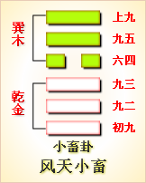

---
hide:
  - navigation
---
# 周易第10卦_履卦(天泽履)_乾上兑下 

<table>
	<tbody>
		<tr>
			<td class="td1">
				</td>
			<td class="td1">
				</td>
			<td class="td1">
				</td>
			<td class="td1">
				</td>
		</tr>
		<tr>
			<td style="text-align: center;">
				<strong>本卦</strong></td>
			<td style="text-align: center;">
				<strong>互卦</strong></td>
			<td style="text-align: center;">
				<strong>错卦</strong></td>
			<td style="text-align: center;">
				<strong>综卦</strong></td>
		</tr>
		<tr>
			<td style="text-align: center;">
				<a href="" style="text-decoration: none;">第10卦：履卦(天泽履)</a></td>
			<td style="text-align: center;">
				<a href="../37.风火家人" style="text-decoration: none;">第37卦：家人卦(风火家人)</a></td>
			<td style="text-align: center;">
				<a href="../15.地山谦" style="text-decoration: none;">第15卦：谦卦(地山谦)</a></td>
			<td style="text-align: center;">
				<a href="../09.风天小畜" style="text-decoration: none;">第9卦：小畜卦(风天小畜)</a></td>
		</tr>
	</tbody>
</table>

## 周易第十卦详解

**履卦原文**

履。履虎尾，不咥人，亨。

象曰：上天下泽，履。君子以辨上下，定民志。

**白话文解释**

履卦：踩着虎尾巴，老虎不咬人，吉利。

《象辞》说：本卦上卦为乾，为天，下卦为兑，为泽，上天下泽，尊卑显别，这是履卦的卦象。君子观此卦象，从而分别上下尊卑，使人民循规蹈矩，安份守纪。

**《断易天机》解**

履卦乾上兑下，为艮宫五世卦。履为履行之意，又寓意礼，提示占筮者要兢兢戒惧，遵守礼节，这样才有惊无险。

**北宋易学家邵雍解**

步履不安，困难危险；谦虚自重，敬慎事主。

得此卦者，困难时期，多坎坷不顺，万事不宜急进，须循序渐进，谨慎行事。

**台湾国学大儒傅佩荣解**

时运：依序升进，不可攀缘。

财运：明察货品，待时而售。

家宅：门庭严整。

身体：疏通气血。

**传统解卦**

这个卦是异卦（下兑上乾）相叠，乾为天，兑为泽，以天喻君，以泽喻民，原文：“履（踩）虎尾，不咥（咬）人”。因此，结果吉利。君上民下，各得其位。兑柔遇乾刚，所履危。履意为实践，卦义是脚踏实地的向前进取的意思。

大象：柔弱遇刚强，欲行却难行之象，难且危也。

运势：先劳而后逸，始惊而后安，百事不宜急进，须以和待人，有惊无险。

事业：起初很不顺利，受到种种威胁，若能提高警惕，谨小慎微，脚踏实地，逐个地去克服困难，不改变自己的决心，一定可以达到目的。办事有自知之明，务必量力而行，不可不顾实际，尤其不得逞强，急于求成。

经商：宜待观动静，勿为小利而动摇自己计划，尤其不得贪得无厌，遵循商业道德，了解全面信息。

求名：务必有恒心，孜孜以求，不为财富利诱，不为世俗干扰，坚持自己的志向和理想，可以取得成功。

婚恋：双方安贫乐道，可和睦相处，若一方为富贵所动，会发生婚变。

决策：诸事必须小心慎重，不利的情况经常会出现，但若能处理得好，总会是有惊无险，化险为夷。为此，办事必须认认真真，遵循正道，虚心听取别人的建议，量力而行，切莫自负逞强，一定会有好的结果。

**第十卦****的哲学含义：**

履卦，这个卦是异卦相叠，下卦为兑，上卦为乾。乾为天;兑为泽，以天喻君，以泽喻民。君上民下，各得其位。

从卦像上看，履卦是兑下乾上。乾刚健，才德无比，这正是兑所不能及的。

从卦形我们还能看出，乾为天在上，兑为泽在下，这意味着天在下雨，地则把雨水汇集为泽。这是顺乎自然、合乎事物存在和发展规律的。所以在学习和实践之中，还要遵循自然的规律。

履卦是兑下乾上，传统称作天泽履。这一卦的卦形，恰好与“小畜”上下相反。彼此是相对卦，一停一进交互为用。《序卦传》说：“物畜然后有礼，故受之以履。履者，礼也。”这是说，物资蓄积后，就要制定礼节，将“履”解释为“礼”。“礼”与“履”同音，“礼”必须人来履行，所以这样解释。

在易经之中，履这一卦主要是践履、履行的意思。《杂卦》说：“履，不处也。”履是行进而不停留。《说文》中指出：“履，足所依也。”履是脚上穿的鞋子。综上所述，履的本义是鞋子，引伸为践履，履进，礼节。古人认为，人的行动要受到礼的节制，不然就会乱来，故履有该怎样行动的意思，这就是礼。

履卦与小畜互为综卦，这两卦的卦爻结构都是一阴对五阳，但是小畜卦的六四以阴居阴，当位得正，柔顺利贞，能够蓄止刚势力前进的势头，而履卦的六三以阴居阳，本身也带有一事实上的刚性，由此而形成的态势就不是如同小畜卦那样的以柔软蓄刚，而是以刚遇刚了。

履卦的智慧之象，有笠，成立义;文书破，损义;女子乃好，有伞有所庇盖;卓旗官人边坐，门旗义;堠上有千里字，坐镇千里之侯伯。

## 周易第十卦初九爻详解

**初九爻辞**

初九。素履，往无咎。

象曰：素履之往，独行愿也 。

**白话文解释**

初九：以朴素坦白的态度处世，没有灾害。

《象辞》说：以朴素坦白的态度处世，是说能独行其志愿。

**北宋易学家邵雍解**

平：得此爻者，营谋有计，则财利日增。做官的若修德养身，则有升迁之机。

**台湾国学大儒傅佩荣解**

时运：等待时机，自有成就。

财运：守好旧业，久必获利。

家宅：门庭吉祥。

身体：慢跑有益。

**初九变卦**

初九爻动变得周易第6卦：天水讼。这个卦是异卦（下坎上乾）相叠。同需卦相反，互为“综卦”。乾为刚健，坎为险陷。刚与险，健与险，彼此反对，定生争讼。争讼非善事，务必慎重戒惧。

**初九爻的哲学含义：**

素：质朴无文曰“素”，持守本性曰“素”。“履”指鞋，也指出行。因此“素履”相应有两层意思：一是素鞋，代指身份，荀爽曰：“素履者，谓布衣之士”。二是素行，直行，即坚守自己的信条，率本性而为，喻指行为清正纯洁。

从卦象上看，初九是阳爻居于刚位，在最下位，象征有才能，却甘心情愿安于低下的地位。这是踏步前行的第一步，还不曾被富贵诱惑，仍然本着自己平素的志向前进，所以不会有过失。

《象》曰：素履之往，独行愿也。这里的“独”，是指特立独行，不随世俗，独行其志，而不是为了利益。这一爻说明实践理想、履行责任，应当一本初衷，特立独行不同流合污。

占得此卦者，在为人做事方面，可以依自己的志向去行事，不图任何利益。就像是刚毕业的学生一样，虽然很有才能，但是因为刚参加工作，还要从低处做起，不去计较眼前的得失，不为外界的诱惑所动，独行守常理，为日后的发展打下基础。

从卦象上看，九二位下卦之中，直道中行，以实才干事。但是其属于阳爻居于阴位，失位。从卦中所看九二的处境，可以说是进而有碍，强行有忧。以幽处守志为吉，幽处非无所作为，而是深自砥砺，不断增益。

《象》曰：“幽人贞吉”，中不自乱也。意思是说，“幽居的人可获吉祥”，说明自己内心平静自然毫不紊乱，循礼仪而行的信念坚固。

占得此卦的人，可能所处的形势对你不利，不能一展才华，大施身手，但是，可以趁这个机会来磨炼自己，比如清代富商胡雪岩在年轻时，因帮助朋友而被辞退在家，无事可做时，他就开始练习算盘，学习记账。他这就是在为以后的发展打基础。占得此卦者，可以趁这个机会学习知识，独善其身，增强自己的能力。

九二与九五爻不相应，所以得不到九五的支持，可是他能够居中守正，并且做事提前做好谋划，虽然不得位也会吉祥。大大方方走在平坦的大道上，可是内心却早已把应对各种危险的方法考虑周全了，怎么会不吉祥呢?这就好比拿破仑所说，作为一名合格的将领，应当随时考虑好发生意外时的解决办法。这位世界军事奇才正是在平时养成了战略部署习惯，所以他才能够成为常胜将军。

“九二”阳刚得中，似心怀坦荡的隐士，执者纯正，不求闻达，不被世俗所扰，当然吉祥。

## 周易第十卦九二爻详解

**九二爻辞**

九二。履道坦坦，幽人贞吉。

象曰：幽人贞吉，中不自乱也。

**白话文解释**

九二：行道之人，胸怀坦荡；隐居之人，长逢吉兆。

《象辞》说：隐居之人洁身守正，因为他们秉性中正，不被世俗所惑。

**北宋易学家邵雍解**

平：得此爻者，安然自乐，修身养性。做官的会有全身而退之兆。

**台湾国学大儒傅佩荣解**

时运：高尚其志，修身以道。

财运：物价稳定，稍有小利。

家宅：分析财产，小心损耗。

身体：保养眼睛。

**九二变卦**

九二爻动变得周易第25卦：天雷无妄。这个卦是异卦（下震上乾）相叠。乾为天为刚为健；震为雷为刚为动。动而健，刚阳盛，人心振奋，必有所得，但唯循纯正，不可妄行。无妄必有获，必可致福。

**九二爻的哲学含义：**

从卦象上看，九二位下卦之中，直道中行，以实才干事。但是其属于阳爻居于阴位，失位。从卦中所看九二的处境，可以说是进而有碍，强行有忧。以幽处守志为吉，幽处非无所作为，而是深自砥砺，不断增益。

《象》曰：“幽人贞吉”，中不自乱也。意思是说，“幽居的人可获吉祥”，说明自己内心平静自然毫不紊乱，循礼仪而行的信念坚固。

占得此卦的人，可能所处的形势对你不利，不能一展才华，大施身手，但是，可以趁这个机会来磨炼自己，比如清代富商胡雪岩在年轻时，因帮助朋友而被辞退在家，无事可做时，他就开始练习算盘，学习记账。他这就是在为以后的发展打基础。占得此卦者，可以趁这个机会学习知识，独善其身，增强自己的能力。

九二与九五爻不相应，所以得不到九五的支持，可是他能够居中守正，并且做事提前做好谋划，虽然不得位也会吉祥。大大方方走在平坦的大道上，可是内心却早已把应对各种危险的方法考虑周全了，怎么会不吉祥呢?这就好比拿破仑所说，作为一名合格的将领，应当随时考虑好发生意外时的解决办法。这位世界军事奇才正是在平时养成了战略部署习惯，所以他才能够成为常胜将军。

“九二”阳刚得中，似心怀坦荡的隐士，执者纯正，不求闻达，不被世俗所扰，当然吉祥。

## 周易第十卦九三爻详解详解

**六三爻辞**

六三。眇能视，跛能履。履虎尾，咥人，凶。武人为于大君。

象曰：眇能视，不足以有明也。跛能履，不足以与行也。咥人之凶，位不当也。武人为于大君，志刚也。

**白话文解释**

六三：瞎了眼睛却要看物，跛了脚却要行走，这是勉为其难，犹如踩着虎尾巴，终将为虎所伤。这是凶险之事。武人纂夺国政，同样是凶险之事。

《象辞》说：瞎了眼睛却要看物，其视力不足以辨物。跛了脚却要行走，其脚力不足以行路。老虎之所以伤人，因为六三阴爻而居于阳位，所处不当。武人纂夺国政，这是僭越犯上，以六三之位而行九五之志，必遭祸殃。

**北宋易学家邵雍解**

凶：得此爻者，会有争诉，囚狱之扰，甚者家破人亡。做官的则会有被贬职之祸。

**台湾国学大儒傅佩荣解**

时运：退守为宜，妄动则凶。

财运：被人欺弄，货物滞销。

家宅：暗昧不明，以小凌大。

身体：保养眼睛与脚部。

六三变卦

六三爻动变得周易第1卦：乾为天。这个卦是同卦（下乾上乾）相叠。象征天，喻龙（德才的君子），又象征纯粹的阳和健，表明兴盛强健。乾卦是根据万物变通的道理，以“元、亨、利、贞”为卦辞，表示吉祥如意，教导人遵守天道的德行。

**九三爻的哲学含义：**

六三这一爻辞告诉人们的道理就是：莫逞匹夫之勇。

从卦象上看，六三这一爻属于阴爻居于阳位，失位而且不居中。阴爻代表能力很弱，只宜顺守，不宜盲目亢进追随诸阳去冒险。

占得此卦者，切忌逞强，要安守本分，只做力所能及的事情。也不要过于悲观，你的处境还不是最坏，就像眼睛虽然有毛病，但是不影响看东西，腿脚有毛病，但是还能行走一样。这种时候，可选力所能及的事情来做，以避免凶险。

六三爻是履卦的唯一一个阴爻，可是它却没有小畜的唯一的阴爻运气好。为什么呢?因为首先它阴爻居于奇位，既不得位又不居中;其次，它凌驾于两个刚爻之上，以柔乘刚自然得不到下面阳爻的拥护。所以这个六三爻就像瞎了一只眼的人看东西，跋了一条腿还要走路一样，是不会走得长远的。所以会凶险。六三虽然也想统治五个阳爻，但却像武士想当天子一样可笑。这句受辞是告诫人们，自己的目标要与自己的能力及所处的地位相适宜，否则，只能是招致凶险。

## 周易第十卦九四爻详解详解

**九四爻辞**

九四。履虎尾，愬愬，终吉。

象曰：愬愬终吉，志行也。

**白话文解释**

九四：踩着虎尾巴，但能遇险知惧，最后仍吉利。

《象辞》说：恐惧警惕，终归于吉，说明虽历磨难，但志愿得行。

**北宋易学家邵雍解**

平：得此爻者，会有危险，宜温和自持，可免灾祸。做官的会有虎符将帅之兆。读书人将会取得不错的佳绩。

**台湾国学大儒傅佩荣解**

时运：温和笃实，终可免祸。

财运：不急求售，终获利益。

家宅：平稳持家。

身体：谨慎走路。

**九四变卦**

九四爻动变得周易第61卦：风泽中孚。这个卦是异卦（下兑上巽）相叠。孚本义孵，孵卵出壳的日期非常准确，有信的意义。卦形外实内虚，喻心中诚信，所以称中孚卦。这是立身处世的根本。

**九四爻的哲学含义：**

从卦象上看，九四处于上卦乾的下位，紧挨着九五君主的位置，九四为近君大臣，有尾随虎君之象。但是，九四又表现出极为驯服，心怀恐惧之象。

《象》曰：“恝恝终吉”，志行也。这句话的意思是说，“感到恐惧害怕，但谨慎小心，终久获得吉祥”，说明小心遵循礼仪而行就能实现自己的志愿。

占得此卦的人，在做事和与人交往时，要有步履薄冰的感觉，小心谨慎，就能度过危险，而迎得圆满的结果。

九四位于九五君位之下，所以也会犯些错误——履虎尾，不过九四能够以恐惧之心对待这件事，明白自己的过失，内心反省，更加谨慎行事，所以最终吉祥。

“九四”不中不正而近君，有踩虎尾的危险。但居阴位，能恐惧小心地走在虎后，终会吉祥。

## 周易第十卦九五爻详解详解

**九五爻辞**

九五。夬履，贞厉。

象曰：夬履贞厉。位正当也。

**白话文解释**

九五：行为急躁莽撞；卜其行事有危险之象。

《象辞》说：行为急躁莽撞，卜其行事有危险之象，但九五阳爻居上卦中位，正当其位。因而虽险不凶。

**北宋易学家邵雍解**

凶：得此爻者，躁动妄行者，则祸患将至，甚者有性命之忧。做官的会功高盖主，而不赏。

**台湾国学大儒傅佩荣解**

时运：拨云见日，勿忘艰苦。

财运：和衷共济，惜售有利。

家宅：居安思危，可保平安。

身体：由危转安。

**九五变卦**

九五爻动变得周易第38卦：火泽睽。这个卦是异卦（下兑上离）相叠。离为火；兑为泽。上火下泽，相违不相济。克则生，往复无空。万物有所不同，必有所异，相互矛盾。睽即矛盾。

**九五爻的哲学含义：**

从卦象上看，九五这一爻属于阳爻居于刚位，居中守正。其处于上卦乾的中心，阳气很盛，从全卦来看，没有爻位与其正应，就像各各在上的皇帝一样，拒人于千里之外，如此骄妄，十分凶险。

《象》曰：“夬履贞厉”，位正当也。这句话是告诫人们，“刚毅果断，小心行动，要提防危险”，说明此时虽处于正当的位置，但也不能疏忽大意。

九五这一爻，是处于君王之位。所以若是占得此卦者，可能会是领导，但是身为领导，不可一意孤行，刚愎自用。在做事时，不可贸然前行，不顾一切。过于快捷果断地向前推进，有时会可能损害他人的自尊或利益，也使人看不清前面的危险和陷阱，会遇到麻烦的。

占得此卦的人，在做任何事之前，要反复考虑，不要突然做出决断，决然而行或行为莽撞急躁，将会有危险。

身为九五之尊，如果不懂得行使自己的权力去解决困境，后果肯定是不堪设想。与其被排挤走，不如用“夹屨”来改善处境。

“九五”中正，刚断果决。但以刚居刚，独断独行，前途凶险。所以必须循礼果决，但这样也难免有危难。

## 周易第十卦上九爻详解详解

**上九爻辞**

上九。视履考祥，其旋元吉。

象曰：元吉在上，大有庆也。

**白话文解释**

上九：行为审慎，遇事周密反复地考虑，大吉。

《象辞》说：大吉大利，因为上九之爻居全卦之首。预兆其人将有重大喜庆之事。

**北宋易学家邵雍解**

吉：得此爻者，财利可获。做官的宜退而以享安静和平之福。读书人努力者可获佳绩。

**台湾国学大儒傅佩荣解**

时运：晚运亨通，福寿双全。

财运：往来经营，无不有利。

家宅：积善之家才有余庆。

身体：天年有限。

**上九变卦**

上九爻动变得周易第58卦：兑为泽。这个卦是同卦（下泽上泽）相叠。泽为水。两泽相连，两水交流，上下相和，团结一致，朋友相助，欢欣喜悦。兑为悦也。同秉刚健之德，外抱柔和之姿，坚行正道，导民向上。

**上九爻的哲学含义：**

履卦第六爻爻辞释义

视：察看，审视。视履，审察一下走过的路。考祥：全面仔细地考虑。旋：反复，返回。

这句爻辞的意思是：回头看看走过的路，详细察看一下吉凶祸福，反身自省，这样是吉祥的。

从卦象上看，上九属于阳爻居于柔位，谦虚柔顺，德才兼备。其处于履卦的最上端，象征着跟君主做过事，但是现在是退休的开国元老。其安心回家，反省自己的经历，总结经验，大吉大利。

能够时刻检查自己的行为，改掉缺点，发扬优点，这种习惯自然会使人生减少失误，所以会吉祥。这正如孔子所说：“吾日三省吾身。”能做到这一点，一生就会有大的收获，有大的成就。所以象辞中说“大有庆”也。