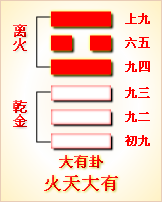

---
hide:
  - navigation
---
# 周易第13卦_同人卦(天火同人)_乾上离下 

<table>
	<tbody>
		<tr>
			<td class="td1">
				</td>
			<td class="td1">
				</td>
			<td class="td1">
				</td>
			<td class="td1">
				</td>
		</tr>
		<tr>
			<td style="text-align: center;">
				<strong>本卦</strong></td>
			<td style="text-align: center;">
				<strong>互卦</strong></td>
			<td style="text-align: center;">
				<strong>错卦</strong></td>
			<td style="text-align: center;">
				<strong>综卦</strong></td>
		</tr>
		<tr>
			<td style="text-align: center;">
				<a href="" style="text-decoration: none;">第13卦：同人卦(天火同人)</a></td>
			<td style="text-align: center;">
				<a href="../44.天风姤" style="text-decoration: none;">第44卦：姤卦(天风姤)</a></td>
			<td style="text-align: center;">
				<a href="../07.地水师" style="text-decoration: none;">第7卦：师卦(地水师)</a></td>
			<td style="text-align: center;">
				<a href="../14.火天大有" style="text-decoration: none;">第14卦：大有卦(火天大有)</a></td>
		</tr>
	</tbody>
</table>

## 周易第十三卦详解

**同人卦原文**

同人。同人于野，亨。利涉大川，利君子贞。

象曰：天与火，同人；君子以类族辨物。

**白话文解释**

同人卦：聚众于郊外，将行大事，吉利。有利于涉水渡河，有利于君子的卜问。

《象辞》说：同人之卦，上卦为乾为天为君王，下卦为离为火为臣民，上乾下离象征君王上情下达，臣民下情上达，君臣意志和同，这是同人的卦象。君子观此卦象，取法于火，明烛天地，照亮幽隐，从而去分析物类，辨明情状。

**《断易天机》解**

同人卦乾上离下，为离宫归魂卦。同人卦象征交结情深，两人契义，同心断金。主所求皆得，事事称心。

**北宋易学家邵雍解**

人类相亲，与人和同；所求皆得，无不称心。

得此卦者，吉祥如意，与人合作共事更佳，上下同心，谋事有成。

**台湾国学大儒傅佩荣解**

时运：朋友支持，升迁顺利。

财运：合资有利，可以进取。

家宅：合家欢喜。

身体：燥热之症，另求良医。

**传统解卦**

这个卦是异卦（下离上乾）相叠，乾为天，为君；离为火，为臣民百姓，上天下火，火性上升，同于天，上下和同，同舟共济，人际关系和谐，天下大同。

大象：二人同心，其利断金，君子正心诚意，与人和同之象。

运势：如意吉祥，与人共事，上下皆和，又得长辈提拔。

事业：顺利、平安，尤其是在与他人的合作方面会十分成功，宜广泛开展人际活动，建立广泛的联系，克服狭隘的门户之见，照顾各方面的利益，求大同，存小异，坚持正确的原则，必能成就大事业。

经商：以真诚合作、精诚团结的态度与同行共事，公平竞争，必可获得自己应得的利益。

求名：自己必须刻苦努力，尤其要取得师长和志同道合的朋友指教、帮助，自己虚心进取，完全能够达到目的。

婚恋：多情、善交际，认识的异性朋友多，故需慎重选择，注意维护双方关系和家庭和睦。

决策：性格开朗、乐观，为人热情，人际关系好，社交能力强，要善于同他人合作，尤其要协调多方面的关系，要有原则性，与不良风气斗争，有魄力，敢作敢为，富有自我奉献精神，并具有统御能力，适于担任一定的负责。

**第十三卦的哲学含义 **

天火同人卦是异卦相叠而成，下卦为离，上卦为乾。乾为天，为阳，高高在上，把光明洒向人间，给人带来光明，带来温暖。离为火，在下，火光熊熊，也能给人带来光明，带来温暖。由此可见，太阳和火两者的位置虽然不同，但是作用却是一样，可谓是志同道合，由此称为同人。

《象》曰：天与火，同人；君子以类族辨物。这是告诉人们说，君子要明白物以类聚，人以群分的道理，明辨事物，求同存异，团结众人以治理天下。

同人卦象征上下和同，属于中上卦。《象》中这样来断此卦：心中有事犯猜疑，谋望从前不着实，幸遇明人来指引，诸般忧闷自消之。

## 周易第十三卦初九爻详解

**初九爻辞**

初九。同人于门，无咎。

象曰：出门同人，又谁咎也。

**白话文解释**

初九：聚集大众于王门，将行大事，没有灾祸。

《象辞》说：君王走出王门与国人打成一片，谁又会遭受灾祸呢？

**北宋易学家邵雍解**

平：得此爻者，能与人合伙经营获利，或出家远行，或修造门户，或在他处学习。做官的或会受到重用，或有升迁之机。

**台湾国学大儒傅佩荣解**

时运：眼前平顺，外出经营。

财运：不宜开店，可以行商。

家宅：家人和睦。

身体：避地调养，可以无碍。

**初九变卦**

初九爻动变得周易第33卦：天山遁。这个卦是异卦（下艮上乾）相叠。乾为天，艮为山。天下有山，山高天退。阴长阳消，小人得势，君子退隐，明哲保身，伺机救天下。

**初九爻的哲学含义 **

初九这一爻为同人卦最初始的状态，这一爻属于阳爻居刚位，位正，得势。与“九四”同性相斥，不相应；但也象征他们中间没有私情存在，与人交往的公正与广阔。所以说，是在门外与人交往。虽然没有到达“卦辞”中的“野”那样的大同程度，但已超越在一门之内的狭隘的近亲关系。像这样交往广阔，当然不会有过失。

如果你在做事时，出于公心，不偏私，不护短，那么就能得志同道合的人，来一起开创事业。

走出家门，去与志同道合的人相聚，怎么会有过失呢？有了问题，到外面求众人的帮助，怎么会有过失呢？走出家门，脱离自己的小圈子，到民众中去，怎么会有过失呢？这就是“同人干门，无咎”。在我国古代，一般有了大事，君王不能解决的大事，便要贴皇榜，请天下有能力之人前来解决。

这皇榜一般贴在午门外或城门口，可以使更多的人看到。这就是“同人于门”。

所以说，“同人于门”即有求天下贤人辅佐的意思，又有与民众打成一片的意思。能做到这些，肯定不会有过失的。

## 周易第十三卦九二爻详解

**六二爻辞**

六二。同人于宗，吝。

象曰：同人于宗，吝道也。

**白话文解释**

六二：聚同族于宗庙，卜祷凶吉，因为面临艰难。

《象辞》说：仅仅聚同族于宗庙，这是狭隘的宗法原则。

**北宋易学家邵雍解**

凶：得此爻者，事多不定，与宗人朋友多不和，相互多猜忌，面和心不合，容易起是非。做官的没有升迁之机，需耐心等待。

**台湾国学大儒傅佩荣解**

时运：相忌者多，未能顺遂。

财运：大宗买卖，留心出纳。

家宅：长子之力，勤俭起家。

身体：魂归宗庙，未可多言。

**六二变卦**

六二爻动变得周易第1卦：乾为天。这个卦是同卦（下乾上乾）相叠。象征天，喻龙（德才的君子），又象征纯粹的阳和健，表明兴盛强健。乾卦是根据万物变通的道理，以“元、亨、利、贞”为卦辞，表示吉祥如意，教导人遵守天道的德行。

** 九二爻的哲学含义 **

宗：是宗族。吝：偏狭，鄙吝。

从卦象上看，六二属于阴爻居阴位，得位，中正，与“九五”阴阳相应，通常是吉象。但是，在这个同人的卦中，相应代表有私情、私心的存在，这一卦，是在阐扬天下大同的理想世界，需要公正、无私地交往，所以六二与九五相应反而成为不利的关系，因而不相宜。这就像只是在宗族中交往，只是在同姓中交往，有着私心一样。这种宗族和同的态度，虽然不能说错，但也不值得赞扬。这一爻，说明应进一步打破宗族观念，扩大交友的圈子和交往的范围。只与同宗人亲附，会有弊病，行事必然艰难。应该把目光放长远一些，多和外界接触。

《象》曰：“同人于宗”，吝道也。这是告诉人们，不能团结各个阶层的人，是引起麻烦的根源。所以如果你想做事，不要只依赖于同宗族的人。尤其是一些夫妻店、家族企业，处理不好可能会因为利益而互相猜疑，为此伤了亲情。

要打破这个界限，团结上上下下的人，这样对事业会更有利。

## 周易第十三卦九三爻详解详解

**九三爻辞**

九三。伏戎于莽，升其高陵，三岁不兴。

象曰：伏戎于莽，敌刚也，三岁不兴，安行也。

**白话文解释**

九三：将军队隐蔽在深山密林，并且占领了制高点，但长时期不能取胜。

《象辞》说：将军队隐蔽在深山密林，因为敌人太强大。长时期不能取胜，怎能有所作为呢？

**北宋易学家邵雍解**

凶：得此爻者，或有丧亲，或有诉讼打官司之患。做官的须防被免职之忧。

**台湾国学大儒傅佩荣解**

时运：潜心三年，再谋其事。

财运：可开山林，三年获利。

家宅：须防盗贼。

身体：不良于行。

**九三变卦**

九三爻动变得周易第25卦：天雷无妄。这个卦是异卦（下震上乾）相叠。乾为天为刚为健；震为雷为刚为动。动而健，刚阳盛，人心振奋，必有所得，但唯循纯正，不可妄行。无妄必有获，必可致福。

**九三爻的哲学含义 **

九三：伏戎于莽，升其高陵，三岁不兴。爻辞释义

伏：指埋伏，潜伏，欲战而不出。戎：指军队，士兵。莽：指荒原草丛，丛林。升：登上。陵：山丘。

本句爻辞的意思是：把军队埋伏在密林草莽之中，占据附近的制高点守望着，过了三年，都不敢贸然出兵。

九三这一爻，从与其他爻的关系来看，可以这样打个比方：六二是阴爻代表女人，九三是阳爻居阳位，而且处于下卦的最上端，代表男人。而全卦之中，最强势的是九五这位，同样是阳爻居阳位，处于君主之位，是比九三更强一个男人。九三是一个小国的首领，一个比自己更强大的外帮首领看中了九三境内的一个美女。为了讨好比自己更强大的外帮首领，打算把这位美女派去和亲，可是九三自己看了这位美女，强行把美女留下来与自己成婚。他担心对方的首领一怒之下前来进犯，而自己又不是人家的对手，所以才出现了爻辞中所描绘的那样，带兵埋伏在林莽之中，时刻警惕着，好在盟国没有来犯，没有发生灾难。

占得此爻者，要注意维持与外界的关系，不要因为一己私利，而将与盟友的关系搞得剑拔弩张，让自己费尽了精力，给自己带来了恐惧与不安。

埋伏兵甲于草莽中，三年都不敢与敌人进行正面的交锋，这可真是够谨慎的。可是谨慎总不会犯大错误，虽然伏于草莽中日子清苦，但却可以保存实力。这里讲的可能仍是高宗讨伐鬼方的事情。鬼方是我国古代西北的一个部落。历来我国北部的民族勇猛好战，所以高宗这次征伐最初肯定是出师不利。敌人太强大，怎么办?只能等待时机。伏兵于草莽中，研究新的作战部署，寻找可以一举歼灭敌人的战机。“三年不兴”，其实也就是说三年后始兴。也就是说三年后打败了敌人。这是面对强敌必须采取的战略战术。

## 周易第十三卦九四爻详解详解

**九四爻辞**

九四。乘其墉，弗克攻，吉。

象曰：乘其墉，义弗克也，其吉，则困而反则也。

**白话文解释**

九四：爬上了敌人的城墙，城还没有攻下来，继续攻打才能获胜。

《象辞》说：爬上了敌人的城墙，从道义上讲应该停士攻城。之所以继续攻打为吉利，因为困守之敌可能逞其狡诈。

**北宋易学家邵雍解**

平：得此爻者，亲友之间会互相猜忌，荣中有辱，结果会好些，凡事须多加提防则可吉祥。做官的若能兢兢业业，则有提拔之机遇，或会受到表彰。

**台湾国学大儒傅佩荣解**

时运：退守不动，反而吉祥。

财运：守货不售，将可获利。

家宅：修缮房屋围墙。

身体：虽有凶险，终究无害。

**九四变卦**

九四爻动变得周易第37卦：风火家人。这个卦是异卦（下离上巽）相叠。离为火；巽为风。火使热气上升，成为风。一切事物皆应以内在为本，然后伸延到外。发生于内，形成于外。喻先治家而后治天下，家道正，天下安乐。

** 九四爻的哲学含义 **

同人卦第四爻，爻辞：九四：乘其墉，弗克攻，吉。

占得此爻者，要懂得适时放弃。就像登上城墙准备与敌人开战，却放弃了，这样反而能得到吉祥的结果。

《象》曰：“乘其墉”，义弗克也，其“吉”，则困而反则也。这就是告诉人们说，“准备登城向敌人进攻”，但终于没有进攻，是因为发现这种进攻是不仁义的，这样做能获得吉祥，是因为在困惑时能及时醒悟，反过来能按正确的办法行事。

## 周易第十三卦九五爻详解详解

**九五爻辞**

九五。同人，先号啕而后笑，大师克相遇。

象曰：同人之先，以中直也。大师相遇，言相克也。

**白话文解释**

九五：聚集起来的大众先哭嚎后欢笑，因为大军及时增援，大获胜仗。

《象辞》说：聚集起来的大众之所以先哭后笑（战斗转败为胜），因为筮遇此爻，九五居上卦之中位，像人得贞正之道，势必化凶为吉。大军会师，是说我军压倒了敌人。

**北宋易学家邵雍解**

平：得此爻者，先难后易，是非不一。做官的会先贬后升。

**台湾国学大儒傅佩荣解**

时运：辛苦有成，得偿心愿。

财运：小有挫折，终有大利。

家宅：不必惊惶，终于平安。

身体：先危后安。

**九五变卦**

九五爻动变得周易第30卦：离为火。这个卦是同卦（下离上离）相叠。离者丽也，附着之意，一阴附丽，上下二阳，该卦象征火，内空外明。离为火、为明，太阳反复升落，运行不息，柔顺为心。

**九五爻的哲学含义 **

同人卦第五爻，爻辞：九五：同人，先号眺，而后笑，大师克相遇。

《象》中这样解释本爻：同人之先，以中直也；大师相遇，天罔极上遇，言相克也。

这是在说，开始大声痛哭，说明这时内心中正诚信，因不知战事的胜败而焦急痛哭；大军遇到了志同道合者，终于获得了战争的胜利，于是欢笑起来。

在寻找志同道合的人时，肯定会有些阻力，不是轻易就能找到的，你可能为此深深痛苦过。但是只要你不放弃，克服这些阻力，终将会达到目的，露出笑颜。

占得此爻者，当与合作者的谈判正僵持不下时，可能意外地出现一个第三方，使事情向对你有利的方向发展。这个时候，你可以视第三方为“同人”，并想办法扩大自己的战果。

## 周易第十三卦上九爻详解详解

**上九爻辞**

上九。同人于郊，无悔。

象曰：同人于郊，志未得也。

**白话文解释**

上九：聚众于郊外，致祭于神灵祝贺胜利，自然没有悔咎。

《象辞》说：聚众于郊外，援助不广，尚不得行其志。

**北宋易学家邵雍解**

平：得此爻者，宜守常，不宜激进。做官的则多有出差的机会。

**台湾国学大儒傅佩荣解**

时运：闲散之地，诸事无碍。

财运：郊外立业，暂时无利。

家宅：平顺无灾。

身体：恐无生机。

**上九变卦**

上九爻动变得周易第49卦：泽火革。这个卦是异卦（下离上兑）相叠。离为火、兑为泽，泽内有水。水在上而下浇，火在下而上升。火旺水干，水大火熄。二者相生亦相克，必然出现变革。变革是宇宙的基本规律。

**上九爻的哲学含义 **

同人卦第六爻，爻辞：上九：同人于郊，无悔。

上九这一爻是同人卦的最后一爻，属于阳爻居柔位，失位，不得势。而且与九三敌应，距离六二又太远，中间有群阳阻隔，如果强行去与六二结交，必然耗费太多的精力，陷入争乱之中。所以不必争取最佳的状态，不如就近结交，

与“郊”之人合同，可以平静无争地生活。

象曰：“同人于郊”，志未得也。这里指出，“聚合众人于郊外”，显然没有实现自己最初的志向。

占得此爻者，你想做某件事，想结交重要的人或志同道合的人，可是想结交他的人太多，发生内争，你也没有机会去结交，那不如去结交较容易亲近的人。

上九处于乾卦的最外面，乾为郊野，所以此艾有“同人于郊”艾辞。其实在任何一个社会，都有不得志的人。有能力而不得志，只能隐居于平淡之中，这种人可以称之为隐士。上九就是一位隐士，虽然不得志，但是能够与其他隐士一起安守于偏僻的郊区，因为能够守于平淡之中而无非分之想，所以不会发生悔恨的事情。这就如同诸葛亮在《诫外甥》中所言:“夫志当存高远，慕先贤，决情欲，弃凝滞，使庶几之志，揭然有所存，恻然有所感;忍屈伸，去细碎，广咨问，除闲吝，虽有淹了流，何损于美趣，何患于不济。”在平淡之中能做到这些，则自然会成可进，败可守了。