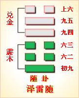

---
hide:
  - navigation
---
# 周易第17卦_随卦(泽雷随)_兑上震下 

<table>
	<tbody>
		<tr>
			<td class="td1">
				</td>
			<td class="td1">
				</td>
			<td class="td1">
				</td>
			<td class="td1">
				</td>
		</tr>
		<tr>
			<td style="text-align: center;">
				<strong>本卦</strong></td>
			<td style="text-align: center;">
				<strong>互卦</strong></td>
			<td style="text-align: center;">
				<strong>错卦</strong></td>
			<td style="text-align: center;">
				<strong>综卦</strong></td>
		</tr>
		<tr>
			<td style="text-align: center;">
				<a href="" style="text-decoration: none;">第17卦：随卦(泽雷随)</a></td>
			<td style="text-align: center;">
				<a href="../53.风山渐" style="text-decoration: none;">第53卦：渐卦(风山渐)</a></td>
			<td style="text-align: center;">
				<a href="../18.山风蛊" style="text-decoration: none;">第18卦：蛊卦(山风蛊)</a></td>
			<td style="text-align: center;">
				<a href="../18.山风蛊" style="text-decoration: none;">第18卦：蛊卦(山风蛊)</a></td>
		</tr>
	</tbody>
</table>

## 周易第十七卦详解

**随卦原文**

随。元亨，利贞，无咎。

象曰：泽中有雷，随。君子以向晦入宴息。

**白话文解释**

随卦：大吉大利，卜得吉兆，没有灾害。

《象辞》说：本卦下卦为震，震为雷，上卦为兑，兑为泽；雷入泽中，大地寒凝，万物蛰伏，是随卦的卦象。君子观此卦象，取法于随天时而沉寂的雷声，随时作息，向晚则入室休息。

**《断易天机》解**

随卦兑上震下，为震宫归魂卦。随即顺从、随时之意，占得此卦，凡事顺心，吉无不利。

**北宋易学家邵雍解**

随顺和同，贞固自持；随从机运，不能专横。

得此卦者，宜随大势，其事可成。凡事与他人多沟通交流，可名利双收。切不可坚持己见，专横者事不成。

台湾国学大儒傅佩荣解

时运：明年运行，五年方展。

财运：堆积存货，明春有利。

家宅：防止惊惧。

身体：休养为宜；牢狱之灾。

**传统解卦**

这个卦是异卦（下震上兑）相叠，震为雷，为动；兑为悦，动而悦就是“随”。随指相互顺从，己有随物，物能随己，彼此沟通。随必依时顺势，有原则和条件，以坚贞为前提。

大象：震木在兑泽之下，木必随水漂荡，随者，顺也。

运势：有去旧迎新之吉象，宜与人合作，可获厚利，忌三心两意，或独断独行。

事业：对社会和人生有正确的认识，重视人际关系，善于同他人合作，事业会很顺利。为了保证取得更进一步的成功，不得贪图小利，向比自己优秀的人学习，择善而从，心存诚信、努力开拓事业。

经商：顺利。在与他人的真诚合作下，能够达到预期的目的。在竞争中应保持清醒头脑，从大处、长远考虑，遵守商业道德，保持至诚的态度对待顾客和同行，会保持竞争优势。

求名：在自己刻苦钻研的基础上，虚心向有德有才的师长学习，借助外界的力量，促使自己更快的进步，实现个人的理想。

婚恋：双方情投意合可以成功，家庭和睦，但若迷恋于情爱，会影响双方的事业，务必注意。

决策：个人成长道路并不十分顺利，但由于谦虚、随和，人际关系好，尤其能够得到长辈的器重，各种事都能在他人的帮助和关心下成功。但务必注意追随他人应有的立场和原则，不可趋炎附势，招致祸凶。

**初九爻的哲学含义**

泽雷随卦，指随从、随和、跟随等等。这个卦是异卦相叠，下卦为震，上卦为兑。震为雷、为动；兑为悦。动而悦就是“随”。

从卦象上分析，豫卦上卦为兑为泽为喜悦，下卦为震为雷为动，雷在泽中、心喜而动便是豫卦的卦象。雷怎么会藏在沼泽地里呢？原来，古人通过观察，发现春雷响过之后，惊醒了蛰伏的动物，于是万物苏醒，大地上开始呈现出勃勃生机。可是到了秋天的阴历八月以后，便没有雷声了，一些动物开始为冬眠做准备。通过这个现象，古人认为这就是天道的善意，天气转暖了，天用雷声唤醒大地上的万物；天气转凉了，天便把雷藏了起来，不再惊动大地上的万物了。由于此时沼泽地里也会发出一种声音，所以人们便认为雷到了秋天便藏到了沼泽地里了。从这个卦象中可以看出，随卦还有随时而动的含义。而震卦代表动，兑卦代表喜悦，所以有随着喜悦而动，追随喜悦的含义。

随卦之象：云中雁传书，主信至；一堆钱，有才义；朱门内有人坐，主坐官府；一人在门外立，主士人求进，欲得变身。凡事值此，得贵人力。良石琢玉之卦，如水推画之象。

## 周易第十七卦初九爻详解

**初九爻辞**

初九。官有渝，贞吉。 出门交有功。

象曰：官有渝，从正吉也；出门交有功，不失也。

**白话文解释**

初九：馆舍时里发生事故，筮遇此爻则吉，出门同行都得好处。

《象辞》说：官吏把事情办坏了，归从正道则吉利。出门同行都得好处，这是不失正道的缘故。

**北宋易学家邵雍解**

吉：得此爻者，多获利。做官的正当好运，有升迁之机。

台湾国学大儒傅佩荣解

时运：交运之时，利于变动。

财运：货物外售，可以得利。

家宅：装修迁居。

身体：改变用药，远方求医。

**初九变卦**

初九爻动变得周易第45卦：泽地萃。这个卦是异卦（下坤上兑）相叠。坤为地、为顺；兑为泽、为水。泽泛滥淹没大地，人众多相互斗争，危机必四伏，务必顺天任贤，未雨绸缪，柔顺而又和悦，彼此相得益彰，安居乐业。萃，聚集、团结。

**初九爻的哲学含义**

占得此卦者，可能职务会有所变动，但是，你不必为此苦恼，只要坚持正道，最终还是吉祥的。如果因职位变动而觉得不快，不妨到外面去，可能会结交到更好的朋友，也可能找到机会建立新功。但是，要唯正是从，见善则从，这样才没有过失。

随卦是从否卦变化而来的，否卦的上九与初六互换位置，便形成了随卦。可见这个初九爻本来是否卦的上九爻，上九爻来到初九爻，从卦象上看有降职的意思，所以说“官有渝”。原来高高在上，现在来到了最下层，与民众打成一片，所以说“出门刁交有功”。在社会中，高高在上的人总会有变为平民的可能。可是，正是这样才能体察民间疾苦，才能磨练自己的人生阅历，才能使自己的人生走上一个新台阶。比如春秋时期的晋文公重耳，正是十七年的流亡生活，磨砺了他的意志，丰富了他的阅历，从而使他回国后励精图治，成为春秋五霸之一。

## 周易第十七卦九二爻详解

**六二爻辞**

六二。系小子，失丈夫。

象曰：系小子，弗兼与也。

**白话文解释**

六二：抓住了未成年的奴隶，跑了成年的奴隶。

《象辞》说：抓住了小的，跑了大的，意思是两者不能兼得。

**北宋易学家邵雍解**

凶：得此爻者，不安宁，或受小人的暗算，是非不断。当官的宜退守，进取者要有自知之明。

台湾国学大儒傅佩荣解

时运：形势颠倒，最好谨慎。

财运：贪小失大，显然不利。

家宅：家主受累；婚嫁不妥。

身体：顾此失彼。

**六二变卦**

六二爻动变得周易第58卦：兑为泽。这个卦是同卦（下泽上泽）相叠。泽为水。两泽相连，两水交流，上下相和，团结一致，朋友相助，欢欣喜悦。兑为悦也。同秉刚健之德，外抱柔和之姿，坚行正道，导民向上。

**九二爻的哲学含义**

随卦第二爻，爻辞：六二：系小子，失丈夫。

占得此爻者，要注意自己是否太过于轻信于年轻人，或是与小人过从甚密，从而使得经验丰富或者正直的君子看不过去，离你而去。如果这样，你会得不偿

失。

《象》曰：系小子，弗兼与也这句话告诉人们，“倾心随从于年轻小子则会失去阳刚方正的丈夫”，因为二者是互相排斥的，是不可兼得的。正如楚怀王听信令尹子椒、上官大夫靳尚和宠妃郑袖的谗言，而疏远屈原，屈原为表忠心投河自杀。楚怀王就是“系小子，

失丈夫”的下场。

六二阴爻居偶位，既得位又居中得正。可是它却面临着一个双向选择。怎么回事呢?这六二就好比一位女子，与其相临的是一个地位低下的小伙子，可是有一位有权势的人（九五）也喜欢她，她该怎么选择呢?由于小伙子离她近，她选择了小伙子。这就是“系小子，失丈夫”。可是六二的地位相当于大夫之位，他是搜刮民膏民脂进贡给上面的君王呢?还是爱民如子，减轻税收，少给上面的君王进贡呢?这便是六二的两种选择。两者他不能兼顾。从卦象上看，六二选择了爱民，因为得人者得天下嘛。

## 周易第十七卦九三爻详解详解

**六三爻辞**

六三。系丈夫，失小子。随有求得，利居贞。

象曰：系丈夫，志舍下也。

**白话文解释**

六三：抓住了成年奴隶，跑了未成年奴隶。希望无失不如现得。筮遇此爻，卜问居处则吉利。

《象辞》说：抓了大的，跑了小的，其志在于追逐大的，舍弃小的。

**北宋易学家邵雍解**

平：得此爻者，营谋遂意，但宜走正道，才能得利。做官的会得到保举而升迁有望。

台湾国学大儒傅佩荣解

时运：求财求名，皆为正运。

财运：小往大来，利益可期。

家宅：积蓄有成，关心子女。

身体：大人无妨，小孩不利。

**六三变卦**

六三爻动变得周易第49卦：泽火革。这个卦是异卦（下离上兑）相叠。离为火、兑为泽，泽内有水。水在上而下浇，火在下而上升。火旺水干，水大火熄。二者相生亦相克，必然出现变革。变革是宇宙的基本规律。

**九三爻的哲学含义**

随卦第三爻，爻辞：六三：系丈夫，失小子。随有求得，利居贞。

六三的地位比六二大些，所以向上爬的欲望也大。六三就好比一位富贵人家的小姐，与贫民阶层的小伙子们没有什么来往，所以不会与他们之间发生爱情。她愿意与比自己更高贵的人交往，干是便看上了上面的九四。九四在六三的上面，所以地位比六三要高，自然六三也就得处处顺从九四的安排了。所以说六三失去了小伙子（初九），而到了丈夫（九四）。可是要想维持好这个婚姻关系，女方是必须入乡随俗，坚守忠贞之道的。因为富贵人家规矩多嘛。并且六三是豫卦下互卦艮卦的中爻，有止的意思，所以“利居贞”。

## 周易第十七卦九四爻详解详解

**九四爻辞**

九四。随有获，贞凶。有孚在道，以明，何咎。

象曰：随有获，其义凶也。有孚在道，明功也。

**白话文解释**

九四：追名逐利，贪多务获，卜问得凶兆。押送俘虏上路，明于约束，没有灾难。

《象辞》说：追名逐利，贪多务获，这种人遭遇凶险是应该的。谨守信用，严守正道，这是明察事功的结果。

**北宋易学家邵雍解**

平：得此爻者，会得到好人的抬举，化凶为吉。做官的会身居要职，努力进取者可成事，可获得名利。

台湾国学大儒傅佩荣解

时运：吉凶互见，明年吉祥。

财运：虽有获利，小心意外。

家宅：置屋不宜。

身体：先凶后吉。

**九四变卦**

九四爻动变得周易第3卦：水雷屯。这个卦是异卦（下震上坎）相叠，震为雷，喻动；坎为雨，喻险。雷雨交加，险象丛生，环境恶劣。“屯”原指植物萌生大地，万物始生，充满艰难险阻，然而顺时应运，必欣欣向荣。

**九四爻的哲学含义**

随卦第四爻，爻辞：九四：随有获，贞凶；有孚在道，以明，何咎！

占得此爻者，因为诚信待人，不违正道，而有很多追随的人。虽然有人追随是好事，但是不能为满足虚荣心而对他们不加限制，不要什么样的人都接纳，否则会引起其他崇敬者的不满。

九四所处的位置是在九五之下，是君主的近臣，领导的助手，在受到众人的追随时，要防止被领导猜忌。要不违正道，光明磊落，这样领导就会打消对你的猜忌，你也能免除灾难。

九四的“随”指的是什么呢？指的便是六二的追随。从男女关系来说，六三追求九四，九四所以得到了六三而“有获”。另外，九四相当于侯王的地位，又相当于君王的重臣，六三为阴为小人，小人追随有权势的九四，给九四送礼，送糖衣炮弹，九四对人家的好意一概照收，所以“随有获”。可是这样却会导致“九四”失正，近君九五而有能力，虽有所获，但难免凶险。

## 周易第十七卦九五爻详解详解

**九五爻辞**

九五。孚于嘉，吉。

象曰：孚于嘉吉，位正中也。

**白话文解释**

九五：俘虏了不少嘉人，吉利。

《象辞》说：信守中正之道，诸事吉利，因为九五之爻居上卦中位，像人守中正之道。

**北宋易学家邵雍解**

吉：得此爻者，营谋遂意，多喜庆之事，做官的会升职，或多喜事。

台湾国学大儒傅佩荣解

时运：正当好运，诸事皆吉。

财运：货物上品，得利不少。

家宅：积善之家；婚嫁可喜。

身体：无须担心。

**九五变卦**

九五爻动变得周易第51卦：震为雷。这个卦是同卦（下震上震）相叠。震为雷，两震相叠，反响巨大，可消除沉闷之气，亨通畅达。平日应居安思危，怀恐惧心理，不敢有所怠慢，遇到突发事变，也能安然自若，谈笑如常。

**九五爻的哲学含义**

随卦第五爻，爻辞：九五：孚于嘉，吉。

本爻给人的启示是：舍己从善。

九五这一爻处于随卦的君王之位，属于阴爻居阳位，具有阴爻柔顺的特性，尽随时之宜，广施诚信于贤能善美之人，得到了吉祥的结果。

占得此爻者，要真诚地随从于嘉言善行，将诚信给予美善之人。如果你是领导，要给诚信的部下更多的发展空间，听从他们的建议和意见，尊贤尚能，这样结果会大吉。

身为九五的君王，自己有诚信的美德并且懂得宣扬诚信这种美德，当然会吉祥了。君王有诚信的美德，就会得到民众的信任；君王宣扬诚信的美德，就会得到有诚信美德的人的辅佐。所以说吉祥。

## 周易第十七卦上九爻详解详解

**上六爻辞**

上六。拘系之，乃从维之。王用亨于西山。

象曰：拘系之，上穷也。

**白话文解释**

上六：将俘虏拘禁起来，紧紧捆绑，周文王将他们作为人牲在西山祭祀神灵。

《象辞》说：被捆绑拘禁，因为上六居一卦之尽头，像人处于穷困之境地。

**北宋易学家邵雍解**

凶：得此爻者，苦难多多，不很如意，重病者会有生命之忧。做官的须防止小人的谗言。

台湾国学大儒傅佩荣解

时运：困难重重，难以如意。

财运：稳扎稳打，未能伸展。

家宅：家人抱怨；嫁娶有缘。

身体：诚心祷告；可能归魂。

**上六变卦**

上六爻动变得周易第25卦：天雷无妄。这个卦是异卦（下震上乾）相叠。乾为天为刚为健；震为雷为刚为动。动而健，刚阳盛，人心振奋，必有所得，但唯循纯正，不可妄行。无妄必有获，必可致福。

**上九爻的哲学含义**

随卦第六爻，爻辞：上六：拘系之，乃从，维之；王用亨于西山。

《象》曰：“拘系之”，上穷也。意思是说，“只有拘禁起来强迫、命令他，他才不得不顺服追随”，这是因为上六爻高居随卦最上爻，物极必反的缘故。在这一爻，随卦已经走向终结，由随从转为离散，只有归隐才合乎从下的道义。但是九五这个君王离不开上六，要强行挽留，命其为自己效力，由此体现出了随之终善的意义来。

占得此爻，代表着你可能想辞职，但是，领导发现他的事业是离不开你的，一定会强行挽留你，并向你表达诚意。这时不妨就采取随的原则，择善而从。

如果你是领导，手下有人对你不满，想要离开，而你的事业又需要此人的帮助，那就要强行挽留他，并以诚意来感化他。

这句爻辞讲的典故便是文王拘干羑里的事情。纣王娶了九侯的女儿，但是由于九侯的女儿不喜欢纣王的荒淫，导致纣王把她给杀了。余怒之中把九侯也给剁了。鄂侯出面指责纣王，结果被纣王杀死做成了肉脯。文王对此只是轻叹了一声，便被关进了羑里的国家监狱。“拘系之，乃从维之”指的便是文王被拘禁、关押之事。后来纣王认为文王还是比较听话，比较顺从的，便把文王给放了。文王脱离大难，于是在岐山举行祭祀，这便是“王用亨干西山”。

上六处于极亢之位，而随卦是讲顺从、跟随及随时势而动的道理的。所以上六是顺从到了极点。被拘禁，被关押，此时不一味顺从也不行了。所以说随时势而动，处于这种情

况下，就得完全顺从。