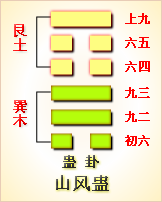

---
hide:
  - navigation
---
# 周易第18卦_蛊卦(山风蛊)_艮上巽下 

<table>
	<tbody>
		<tr>
			<td class="td1">
				</td>
			<td class="td1">
				</td>
			<td class="td1">
				</td>
			<td class="td1">
				</td>
		</tr>
		<tr>
			<td style="text-align: center;">
				<strong>本卦</strong></td>
			<td style="text-align: center;">
				<strong>互卦</strong></td>
			<td style="text-align: center;">
				<strong>错卦</strong></td>
			<td style="text-align: center;">
				<strong>综卦</strong></td>
		</tr>
		<tr>
			<td style="text-align: center;">
				<a href="" style="text-decoration: none;">第18卦：蛊卦(山风蛊)</a></td>
			<td style="text-align: center;">
				<a href="../54.雷泽归妹" style="text-decoration: none;">第54卦：归妹卦(雷泽归妹)</a></td>
			<td style="text-align: center;">
				<a href="../17.泽雷随" style="text-decoration: none;">第17卦：随卦(泽雷随)</a></td>
			<td style="text-align: center;">
				<a href="../17.泽雷随" style="text-decoration: none;">第17卦：随卦(泽雷随)</a></td>
		</tr>
	</tbody>
</table>

## 周易第十八卦详解

**蛊卦原文**

蛊。元亨，利涉大川。先甲三日，后甲三日。

象曰：山下有风，蛊。君子以振民育德。

**白话文解释**

蛊卦：大吉大利。利于涉水渡河，但须在甲前三日之辛日与甲后三日之丁日启程。

《象辞》说：本卦上卦为艮为山，下卦为巽为风，贤人如山居于上，宣布德教施于下，所谓山下有风，这是巽卦盼卦象。君子观此卦象，取法于吹拂万物的风，从而振救万民，施行德教。

**《断易天机》解**

蛊卦艮上巽下，为巽宫归魂卦。蛊是指皿中食物因腐败而生虫，筮遇此卦，半凶半吉。

**北宋易学家邵雍解**

三蛊在器，事物败坏；辛勤丁宁，转危为安。

得此卦者，艰难迷惑之时，事事不如意；宜大胆革新，奋发图强，艰苦努力，可转危为安。

台湾国学大儒傅佩荣解

时运：力图振作，可改旧观。

财运：不宜堆积，应即贩卖。

家宅：整顿家风；恐有私情；生育不顺。

身体：蛊毒之症，小心咒诅。

**传统解卦**

这个卦是异卦（下巽上艮）相叠，与随卦互为综卦。蛊本意为事，引申为多事、混乱。器皿久不用而生虫称“蛊”，喻天下久安而因循、腐败，必须革新创造，治理整顿，挽救危机，重振事业。

大象：风入山下，闭而不出，即物腐生虫，意气不通，因循败事。

运势：诸事不如意，艰难迷惑，宜大胆革新，否则引来内忧外患。

事业：运气处于不佳状态，或因外界条件，或因个人因素所致。唯有谨慎分析原因，找出弊端，坚决而大胆，不惜冒险，战胜阻力。这时一要头脑冷静，二要向高明的人请教，必能创造业绩。

经商：诸多不利困扰着自己，不宜继续走老路。应全面分析市场动向，当机立断，另外找寻出路。

求名：会遇到许多困难和不利，应看作是对自己的考验，要以百倍的勇气，继续奋斗。同时，虚心寻找自己的不足，加以补救。

婚恋：不顺利。双方如情投意合，则应全力以赴促成此事，夫妇应共同努力维系家庭。

决策：生不逢时，家道或事业有中落现象，个人陷入多事之秋。唯有正视现实，勤奋勉励，不屈不挠，有所作为，甚至不惜冒险，挽救败落状况。必要时还需耐心等待时机。

**第十八卦的哲学含义**

蛊卦卦象，山风蛊卦的象征意义

从卦象上看，艮为山，性刚，在上。巽为风，性柔，在下。这就像一座坚固高大的房子建在了柔软的地基上，是非常危险的，随时都可能倒塌。艮为山，含有止的意思，巽为风，含有顺从的意思，上止下顺从，事物肯定就会停止发展，结果会很糟。

本卦中的“蛊”是事，即“有事了”、有“麻烦了”的意思。这里是以腐败来比拟人事，指风云际会之时，也正是英雄用武之际，应以自新的精神来应对。

蛊卦除了揭示人们将陷入麻烦之中，还告诉了人们如何解决麻烦的方法 自新、自省、自察。这样做，会减少麻烦的出现，能把麻烦扼杀在萌芽之

蛊卦位于随卦之后，《序卦》这样说道：“以喜随人者必有事，故受之以蛊。”在此上承豫卦与随卦，亦即愉悦而随从别人，形成某些弊端，需要整顿修

《象》曰：山下有风，蛊；君子以振民育德。《象》解释蛊卦的卦象，认为巽（风）下艮（山）上，为山下起大风之表象，象征救弊治乱、拨乱反正。这时候，君子救济人民，培育美德，纠正时弊。

蛊卦启示了振疲起衰的道理，属于中中卦。《象》中断此卦：卦中爻象如推磨，顺当为福反为祸，心中有益且迟迟，凡事尽从忙处错。

蛊卦的卦画是三个阴爻三个阳爻，随卦的所有阳爻变为阴爻，所有阴爻变为阳交，便形成了蛊卦。可见《周易》中的蛊卦与随卦是有一定联系的。

## 周易第十八卦初九爻详解

**初六爻辞**

初六。干父之蛊，有子，考无咎。厉，终吉。

象曰：干父之蛊，意承考也。

**白话文解释**

初六：继承父业，有一个孝顺的儿子，固然没有灾害，即使遇到危险，最后乃吉利。

《象辞》说：继承父业，意思是继承其父遗志。

**北宋易学家邵雍解**

吉：得此爻者，会得到祖先的庇佑，营谋遂意。做官的会受到重任，改革创新。

台湾国学大儒傅佩荣解

时运：克勤克俭，前途光明。

财运：重整旧业，可以得利。

家宅：改造旧宅；婚嫁可喜。

身体：初无大碍，无子不利。

**初六变卦**

初六爻动变得周易第26卦：山天大畜。这个卦是异卦（下乾上艮）相叠。乾为天，刚健；艮为山，笃实。畜者积聚，大畜意为大积蓄。为此不畏严重的艰难险阻，努力修身养性以丰富德业。

**初九爻的哲学含义**

蛊卦第一爻，爻辞：初六：干父之蛊，有子，考无咎；厉终吉。

占得此卦者，可能是新接一个职位，前任留下了许多麻烦。或者是有一些不良的陈规陋习，或者是一大堆没有解决的问题，也可能是留了许多债务。你要拿出耐心，发挥自己的能力来解决。虽然是麻烦，但是也给你一个施展能力的机会。你是否是一个合格的继承者，是否能胜任此职位，要通过解决这些麻烦来证明。

当然，也可能是父辈给家里面留下了许多麻烦，或是有未尽之志，你要按着父辈的本来意愿，处理好他们留下的问题。

这里是说，儿子继承了家业，应当纠正父亲遗留下来的弊病，只有这样才能保住家业，家业保住了，自然死去的父亲在阴间也会过得安稳，所以“考无咎”。如果儿子不这样做，家业保不住，家族的香火都有断绝的危险，自然躺在坟墓里的父亲也会有灾难了。由干纠正弊端是会带来好处的，所以即使有危险，也要纠正，因为最终会得到吉祥。这就好比汉武帝“独尊儒术，罢黔百家”一改窦太后的治国方法，嘉庆帝杀贪官何珅，改变乾隆时期的政治格局一样，由干是为了最终的吉祥，所以必须要这样做。

## 周易第十八卦九二爻详解

**九二爻辞**

九二。干母之蛊，不可贞。

象曰：干母之蛊，得中道也。

**白话文解释**

九二：继承母业，则吉凶不可卜问。

《象辞》说：继承母业，九二处下卦中位，爻象显示其人得中正之道。

**北宋易学家邵雍解**

平：得此爻者，改旧从新，则会如意。女命勤俭持家，性忠直者多福。

台湾国学大儒傅佩荣解

时运：顺势而行，不可草率。

财运：旧债积弊，缓和处理。

家宅：母系擅权，忍耐协调；可得佳妇。

身体：大人寒症，小孩补气。

**九二变卦**

九二爻动变得周易第52卦：艮为山。这个卦是同卦（下艮上艮）相叠。艮为山，二山相重，喻静止。它和震卦相反。高潮过后，必然出现低潮，进入事物的相对静止阶段。静止如山，宜止则止，宜行则行。行止即动和静，都不可失机，应恰到好处，动静得宜，适可而止。

**九二爻的哲学含义**

蛊卦第二爻，爻辞：九二：干母之蛊，不可贞。

《象》中这样解释本爻：“干母之蛊”，得中道也。这句话告诉人们说，“救治母辈所造成的弊病”，刚柔适中，既要顺应，又要匡救，不可偏颇，不可固执专断。

占得此爻者，处于许多麻烦和问题之中，但是对于这些问题，不要急于表达肯定或否定的意见。要耐心等待，要先看一看，想一想，坚守正道以等时机成熟时再行动。

九二与六五上下相应。六五为泰卦坤母的中爻，变蛊后坤象隐去，所以代表亡母。在男权社会中，女人是不参政的，所以“母之蛊”无非是偏心、溺爱、宫闱余不能太严格地给予纠正的。因为母亲的问题是家庭问题，而父亲的问题是社会问题，有轻重之分。过分纠正母亲的不是，则会有伤孝道，而干治国没有多大益处。

## 周易第十八卦九三爻详解详解

**九三爻辞**

九三。干父之蛊，小有悔，无大咎。

象曰：干父之蛊，终无咎也。

**白话文解释**

九三：继承父业，即使稍有过错，也不会出大问题。

《象辞》说：继承父业，最终不会遭逢灾难。

**北宋易学家邵雍解**

凶：得此爻者，躁进者有失，不听信谗言者则无难。

台湾国学大儒傅佩荣解

时运：痛改前非，仍有未来。

财运：重立旧业，小损大利。

家宅：改造住宅。

身体：应可痊愈。

**九三变卦**

九三爻动变得周易第4卦：山水蒙。这个卦是异卦（下坎上艮）相叠，艮是山的形象，喻止；坎是水的形象，喻险。卦形为山下有险，仍不停止前进，是为蒙昧，故称蒙卦。但因把握时机，行动切合时宜，因此，具有启蒙和通达的卦象。

**九三爻的哲学含义**

蛊卦第三爻，爻辞：九三：干父之蛊，小有悔，无大咎。

蛊卦第三爻，爻辞：九三：干父之蛊，小有悔，无大咎。爻辞释义

本爻的意思是：匡正父辈弊端，会有一些懊悔，但是并无大的危害。

从卦象上看，九三这一爻属于阳爻居阳位，又处在下卦的上位，过于刚强而越离了中道，与上六敌应，有犯上之嫌。也就是在解决弊病时冒犯了父辈或是前

对于一个子女晚辈来说，如果父辈有问题，或者留下了许多麻烦，在改正或挽救的过程中，肯定会冒犯父辈的尊严或面子，使他们觉得难堪，或者因其不愿改正而对子女有意见。做为子女的肯定会有一些悔恨，但是，因为你的行为是正义的，符合正道，所以不会有大的危害。

占得此爻者，可能是到了一个新岗位，要处理前任留下的问题。但是，在处理过程中，注意态度和方法。如果积弊甚深，就应该见机行事，有步骤地向前推进，逐渐用更加合适的秩序来取代旧的秩序。虽然在这过程中会遇到困窘危难，但是因为九三是阳爻居阳位，属于得位，所以不会有大的危害。

九三爻处于下卦的最外面，所做事会有些过火的现象。纠正父亲的过失是应当的，但不能太过火，一过火就会有悔恨的事情发生了。但也不能不纠正，因为这样做会对以后的发展有利，所以不会有大的灾难，最终结局会很好。

“九三”无上应，匡正先辈的弊乱稍有悔恨。但毕竟阳刚得正，不会产生大的灾祸。

## 周易第十八卦九四爻详解详解

**六四爻辞**

六四。裕父之蛊，往见吝。

象曰：裕父之蛊，往未得也。

**白话文解释**

六四：光大父业，施行起来困难重重。

《象辞》说：光大父业(困难重重)，施行之中未尽得当。

**北宋易学家邵雍解**

凶：得此爻者，事事见忧，有足疾。

台湾国学大儒傅佩荣解

时运：不可因循，否则自误。

财运：未能除弊，难以获利。

家宅：父业难保。

身体：急救内患，以免不治。

**六四变卦**

六四爻动变得周易第50卦：火风鼎。这个卦是异卦（下巽上离）相叠。燃木煮食，化生为熟，除旧布新的意思。鼎为重宝大器，三足稳重之象。煮食，喻食物充足，不再有困难和困扰。在此基础上宜变革，发展事业。

**九四爻的哲学含义**

蛊卦第四爻，爻辞：六四：裕父之蛊，往见吝。爻辞释义

裕：指宽容，姑息，宽缓。

本爻的意思是：姑息宽容父辈的弊病，将来必然会出现憾事。

在分析易经各爻时，四爻的特点是惧，恐惧，因为它临近九五，身近君王，心怀忧惧止步不前，乘阳承阴，胆战心惊。这一特点在本卦的六四这一爻中也得到了充分的体现。六四是阴爻居柔位，阴柔有余，阳刚不足，在做事时畏首畏尾，在整治父辈或前任留下的积弊时，没有力度，不能彻底地去解决，优柔寡断，安于静止，不求上进，这样会出现憾事。

占得此爻者，可能到了一个新岗位，虽然发现前任留下许多弊病，但是在做的时候，担心得罪前任，担心下属不满，就睁一只眼闭一只眼，在改正时也是敷衍了事。这样的结果不能整饬积习弊病，反而会助长不正之风蔓延，结果必然会招致凶险。

六四没有“干父之蛊”，而是容忍父亲的错误继续发展下去。这种做法是不值得提倡的，因为再这样发展下去便会有忧

吝的事情发生了。比如乾隆把皇位禅让给嘉庆帝后，却仍然大权独揽，嘉庆帝当时只能“裕父之蛊”。据史书记载，在朝中乾隆坐在嘉庆帝的右边，乾隆大笑，嘉庆帝便跟着干笑，乾隆恼怒，嘉庆帝便不知所措。没办法，自己没有实权，只能“裕父之蛊”。

## 周易第十八卦九五爻详解详解

**六五爻辞**

六五。干父之蛊，用誉。

象曰：干父之蛊，承以德也。

**白话文解释**

六五：继承父业，博得了赞誉。

《象辞》说：继承父业而博得了赞誉，因为继承了其父的美好品德。

**北宋易学家邵雍解**

吉：得此爻者，多喜庆之事，家中或进人口。做官的进取有望，名誉远播。

台湾国学大儒傅佩荣解

时运：自行振作，仍可扬名。

财运：改善旧业，仍然有利。

家宅：努力兴家；嫁娶高亲。

身体：应觅名医。

**六五变卦**

六五爻动变得周易第57卦：巽为风。这个卦是同卦（下巽上巽）相叠，巽为风，两风相重，长风不绝，无孔不入，巽亦为顺、谦逊的态度和行为，可无往不利。

**九五爻的哲学含义**

蛊卦第五爻，爻辞：六五：干父之蛊，用誉。爻辞释义

用：享用。誉：指美誉。

本爻的意思是：挽救父辈败坏的基业，一定会受到人们的赞誉。

《象》曰：“干父用誉”，承以德也。

之所以“挽救父辈所败坏的基业，一定会受到人们的赞誉”，是因为以美德继承父辈的遗业，总是会受到欢迎的。这就是方式方法的问题了。

纵观蛊卦可发现，同样的“干父之蛊”，九三治蛊太过，方法强硬，六四过于柔弱，畏前畏尾，这些做法都是偏离了中庸之道，要不过强，要不过软，没有达到刚柔相济。六五这一爻，是阴爻居于阳位，刚柔并济，得中尊之位，用德而不用威，结果获得了赞誉。

占得此爻者，如果想整顿企业或是改革旧制，采取的方式要符合中道，刚柔并济，要以德来推进，而不单靠强硬的手段来进行，这样才能获得一致的好评。

六五身居君位，以阴柔之德纠正父亲遗留下来的弊端，并且提倡人们以勤俭、正直、仁义、廉政为荣，对勤俭节约、正直仁义、廉洁奉公的人给予高度的赞誉，这样加强精神文明建设无疑会收到很好的效果。比如新中国成立初期，毛主席倡导人民勤俭节约、廉洁奉公、无私奉献、不怕牺牲，结果社会风气得到了很好的改善。人们不羡慕有钱有势的人，却赞扬道德高尚的人，这样就使小人的势力受到了制约与打击，使正义的君子之道得以伸张。这种以德治天下的方法才能够很好地“防蛊”，所以象辞说“承以德也”。

## 周易第十八卦上九爻详解详解

**上九爻辞**

上九。不事王侯，高尚其事。

象曰：不事王侯，志可则也。

**白话文解释**

上九：不服务于王侯，因为其人看重自身价值。

《象辞》说：不服务于王侯，这种志趣可以效法。

**北宋易学家邵雍解**

平：得此爻者，宜守旧，好运者，多遇尊贵，能获得提拔。做官的宜退守，或告休。

台湾国学大儒傅佩荣解

时运：以退为进，较为有利。

财运：不必急售，获利可期。

家宅：住在高处；良缘天成。

身体：大限将至，安其天年。

**上九变卦**

上九爻动变得周易第46卦：地风升。这个卦是异卦（下巽上坤）相叠。坤为地、为顺；巽为木、为逊。大地生长树木，逐渐成长，日渐高大成材，喻事业步步高升，前程远大，故名“升”。

**上九爻的哲学含义**

蛊卦第六爻，爻辞：上九：不事王侯，高尚其事。爻辞释义

不事王侯：是指不再为王侯之事而操劳。

高尚其事：认为自己做的事很高尚。

本爻的意思是：不谋求王侯事业，把这种行为看得很高尚。

《象》曰：“不事王侯”，志可则也。

这句话的意思是说：“不侍奉王侯”，这种高洁的志向，可作为人们学习的准则。

上九这一爻，是蛊卦的最后一爻，意味着治蛊结束，所以功成身退，不再谋求王侯爵位之事，这种做法很高尚，也值得学习。自古以来，“狡兔死，良狗烹”的事情不胜枚举。

占得此爻者，要注意审时度势，不要向领导邀功请赏，也不要争取什么荣誉和职权，用之则行，舍之则藏，洁身归隐。可以不寄人篱下，也不依附于他人，

服从自身的发展需求，专心致力于自己的事业。

上九处于蛊卦的最上面，处蛊的顶点。也就是说社会上淫邪之风、腐败之风已经发展到了极至。这时候君子该怎么办呢?是同流合污，还是与之抗争?可是既然“蛊”已经发展成了大气候，与之抗争无异于以卵击石，自取灭亡。那样一来，社会上的正人君子会更少了。那怎么办呢?所以只能“不事王侯，高尚其事”了。也就是说不在朝中为官，离开淫邪腐败的环境，进行归隐保全。也就是说去当隐士。可是并不是说归隐后两耳不闻窗外事，什么事也不管了。而是应当“高尚其事”，自己认为是高尚的事，并且力所能及，那么这种事情还是要做的。

从卦象上看，蛊卦的上互卦为震，震代表王侯，而上九处于震卦之外，所以有“不事王侯”的卦象。