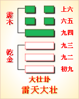

---
hide:
  - navigation
---
# 周易第20卦_观卦(风地观)_巽上坤下 

<table>
	<tbody>
		<tr>
			<td class="td1">
				</td>
			<td class="td1">
				</td>
			<td class="td1">
				</td>
			<td class="td1">
				</td>
		</tr>
		<tr>
			<td style="text-align: center;">
				<strong>本卦</strong></td>
			<td style="text-align: center;">
				<strong>互卦</strong></td>
			<td style="text-align: center;">
				<strong>错卦</strong></td>
			<td style="text-align: center;">
				<strong>综卦</strong></td>
		</tr>
		<tr>
			<td style="text-align: center;">
				<a href="" style="text-decoration: none;">第20卦：观卦(风地观)</a></td>
			<td style="text-align: center;">
				<a href="../23.山地剥" style="text-decoration: none;">第23卦：剥卦(山地剥)</a></td>
			<td style="text-align: center;">
				<a href="../34.雷天大壮" style="text-decoration: none;">第34卦：大壮卦(雷天大壮)</a></td>
			<td style="text-align: center;">
				<a href="../19.地泽临" style="text-decoration: none;">第19卦：临卦(地泽临)</a></td>
		</tr>
	</tbody>
</table>

## 周易第二十卦详解

**观卦原文**

观。盥而不荐，有孚顒若。

象曰：风行地上，观。先王以省方，观民设教。

**白话文解释**

观卦：祭祀时灌酒降神而不献人牲，因为用作祭祀的俘虏的头部肿了，不能用作祭品。

《象辞》说：本卦上卦为巽为风，下卦为坤为地，风行大地吹拂万物，这是观的卦象。先王观此卦象取法于周流八方的风，从而巡视邦国，观察民情，推行教化。

**《断易天机》解**

观卦巽上坤下，为乾宫四世卦。观卦象征将道义展示于众人面前。观卦风在上而地在下，是春风浩荡、万物滋生之象。

**北宋易学家邵雍解**

以下观上，周游观览；平心静气，坚守岗位。

得此卦者，处身于变化之中，心神不宁，宜多观察入微，待机行事，切勿妄进。

台湾国学大儒傅佩荣解

时运：出外游览，不易闲居。

财运：贩卖洋货，须防风险。

家宅：供养神佛。

身体：风湿之症，运动调养。

**传统解卦**

这个卦是异卦（下坤上巽）相叠，风行地上，喻德教遍施。观卦与临卦互为综卦，交相使用。在上者以道义观天下；在下者以敬仰瞻上，人心顺服归从。

大象：风运行于坤地之上，喻有周游观览之意。阴长阳消，正道衰微，万物难行。

运势：处身于变化之中，宜多观察入微，心身苦恼，并防外来诱惑。

事业：事业已出现不顺利的迹象，务必谦虚慎重，高瞻远瞩，尤忌短期行为，心胸开阔，注意搞好人际关系，团结他人，不宜轻率行动。必要时不妨投靠德行高的人，以图再度发展。

经商：市场形势不稳定，正处于变动，应谨慎小心，随时观察动向，从长计议，做好退却的准备。

求名：贵在自知之明，虚心向他人求教，端正处世态度，尤其不可自我满足，更须守中持正，树立远大理想，勿丧失个人追求的目标，勿偏离正道。

婚恋：不顺利，双方应经受住考验，从长计议，会有理想的结果。

决策：具有组织能力，适宜担任负责工作，但人生旅途多曲折，必须注意培养自己的预见性和观察力，办事务必公正，实事求是，注意人心动向，关心他人。尤其不可以陷入小人之道和近视行为之中。应有决断精神，不可盲从，必要时可进行策略依附。

**第二十卦的哲学含义**

观卦卦象，风地观卦的象征意义

风地观卦，这个卦是异卦相叠，下卦为坤，上卦为巽。风行地上，喻德教遍施。巽为风在上，坤为地在下。说明巽在上，为民办事，像风一样迅速，无处不到。地在下，表示地上的万物仰首观察巽的行为，产生敬重和羡慕的心理，决心学习巽的德才。由此可知，观卦本身是以敬重的态度观察和学习他人优点和长处的卦。

观卦启示了观下瞻上的道理，在上者以道义观天下；在下者以敬仰瞻上，人心顺服归从。观卦属于中上卦。《象》这样评断此卦：卦遇蓬花旱逢河，生意买卖利息多，婚姻自有人来助，出门永不受折磨。

风地观卦的卦画是下面四个阴爻，上面两个阳爻，与临卦的卦画排列顺序正好相反。

风地观卦从卦象上进行分析，观卦上卦为巽为风，下卦为坤为地，风吹拂着大地就是观卦的卦象。风无处不在，无孔不入，人也应当像风一样，无所不观，观察万物而得到更多的知识。

## 周易第二十卦初九爻详解

**初六爻辞**

初六。童观，小人无咎，君子吝。

象曰：初六童观，小人道也。

**白话文解释**

初六：愚蠢近视，对一般百姓来讲尚无大碍，但对于担负政治责任的君子来说，将会铸成大错。

《象辞》说：**初六爻辞**讲，愚蠢近视，这正是小人们的思想特征。

**北宋易学家邵雍解**

凶：得此爻者，宜防小人，诸事有困难，弄巧成拙。做官的有危难，不宜进取。

台湾国学大儒傅佩荣解

时运：初运未佳，但无大碍。

财运：初登场面，小作即可。

家宅：小心童仆；自由结亲。

身体：小孩没事，大人不利。

**初六变卦**

初六爻动变得周易第42卦：风雷益。这个卦是异卦（下震上巽）相叠。巽为风；震为雷。风雷激荡，其势愈强，雷愈响，风雷相助互长，交相助益。此卦与损卦相反。它是损上以益下，后者是损下以益上。二卦阐述的是损益的原则。

**初九爻的哲学含义**

观卦第一爻，爻辞：初六：童观，小人无咎，君子吝。爻辞释义。童：幼稚，见识短浅者。

本爻的意思是：用幼稚狭隘浅显的眼光来观察事物，这对无知的庶民来说，不会有害处，但对担任教化重任的君子来说，则应感到羞吝。

《象》曰：初六，“童观”，小人道也。这里指出，人应该有自己的见识，

观察事物不要狭隘浅显，不要只关注眼前利益，而不顾道德风尚。

占得此爻者，应该注意，在观察问题时不要只停留于事物的表面，如果这样，就说明你还不是一个成熟的人，你应该改变思考问题的方式，拓展见识。因为你若是甘愿当一个小人物，这样可以，若是想成为一个担负重任的君子，则必须要变得成熟，否则会造成不利。

## 周易第二十卦九二爻详解

**六二爻辞**

六二。窥观，利女贞。

象曰：窥观女贞，亦可丑也。

**白话文解释**

六二：囿于一孔之见，这是有利于女人的贞兆。

《象辞》说：女人窥视男人，即使操行贞正，亦属可丑的行为。

**北宋易学家邵雍解**

平：得此爻者，在家不如意，外出谋事则好，或喜或忧，或因妇人而起是非，大抵宜动不宜静。此爻女喜，男悲。

台湾国学大儒傅佩荣解

时运：最好退守，女性有利。

财运：蚕丝有利，余皆不宜。

家宅：妇女主家。

身体：阴寒之症，可愈。

**六二变卦**

六二爻动变得周易第59卦：风水涣。这个卦是异卦（下坎上巽）相叠。风在水上行，推波助澜，四方流溢。涣，水流流散之意。象征组织和人心涣散，必须用积极的手段和方法克服，战胜弊端，挽救涣散，转危为安。

**九二爻的哲学含义**

观卦第二爻，爻辞：六二：窥观，利女贞。爻辞释义

窥：从门缝里偷看，侧面观察，暗中打听、了解。

本爻的意思是：暗中窥探观察，只要能像女子那样守正顺从大人，也会有利。

从卦象上看，观卦为放大的艮卦，艮为门阙之意。下卦坤为女。这句爻辞里描绘出一种场景：古代女人受教育有限，又大门不出二门不进，当对外界有好奇心时，只能从门缝里偷看，看到的难免有局限和偏差。

《象》曰：“窥观，女贞”，亦可丑也。

《象》的意思是说：“窥观，对于女人来说有利于坚持正道，固守贞操”，但对男子汉来说，这样的行为就丢丑了。

## 周易第二十卦九三爻详解详解

**六三爻辞**

六三。观我生，进退。

象曰：观我生进退，未失道也。

**白话文解释**

六三：观察亲族的思想动向，从而决定为政的措施。

《象辞》说：观察亲族的思想动向，从而决定为政的措施，这才未失去用人行政的正道。

**北宋易学家邵雍解**

平：得此爻者，三心二意，须谨慎行事，知难而退。做官的进退无常。

台湾国学大儒傅佩荣解

时运：度德量力，稍安毋躁。

财运：随买随卖，不致有失。

家宅：守住旧债。

身体：安心静养，可保平安。

**六三变卦**

六三爻动变得周易第53卦：风山渐。这个卦是异卦（下艮上巽）相叠。艮为山，巽为木。山上有木，逐渐成长，山也随着增高。这是逐渐进步的过程，所以称渐，渐即进，渐渐前进而不急速。

**九三爻的哲学含义**

观卦第三爻，爻辞：六三：观我生，进退。爻辞释义

我：指自己。生：广生，作出决定。

本爻的意思是：观察别人对自己的反应，省察自己的言行，审时度势，小心谨慎地决定进退。

六三爻辞揭示的是一种警戒性的自审行为。在这里，体现了“观”的双向含义，即自己在观察别人，别人也在观察自己，可以通过观察，根据别人对自己的反应，来决定自己的进退。六三为臣位，是阴爻居阳位，失位，很难有什么作为，所以会考量进退的问题。

占得此爻者，在单位中要注意观察一下周围的人对自己的态度和反应，以此判断自己做得怎么样，是否适合现在的职位，以此决定自己的进退。

六三既不得位，又不得中，并且上下又无阴阳相合，所以处境不是很理想。所以她需要仔细观察自己的生存环境，以做好进退的选择。不过六三与上九相应，能靠祖上的余荫生活，这也是六三的优势，所以她能够谨慎地做好进退的选择，便不会迷失正道。

## 周易第二十卦九四爻详解详解

**六四爻辞**

六四。观国之光，利用宾于王。

象曰：观国之光，尚宾也。

**白话文解释**

六四：观察国家政绩风俗的辉煌表现。筮遇此爻，有利于朝觐君王。

《象辞》说：观察国家政绩风俗的辉煌表现，此来者为国宾。

**北宋易学家邵雍解**

平：得此爻者，宜出外谋事，多与外人交往，则有利。做官的或居闲职，清高之地。

台湾国学大儒傅佩荣解

时运：正当好运，名胜于利。

财运：国际贸易，有利有名。

家宅：喜事临门。

身体：多加小心。

**六四变卦**

六四爻动变得周易第12卦：天地否。这个卦是异卦（下坤上乾）相叠，其结构同泰卦相反，系阳气上升，阴气下降，天地不交，万物不通。它们彼此为“综卦”，表明泰极而否，否极泰来，互为因果。

**九四爻的哲学含义**

观卦第四爻，爻辞：六四：观国之光，利用宾于王。爻辞释义

国：举国上下，大范围内。光：民俗风情。

宾：程颐曾经说过：“古者有贤德之人，是人君宾礼之，故士之仕进于王朝，则谓之宾。”宾，是从，是客，古代为官有如君王邀请的宾客，所以这里指跟随君王做事，当官。

本爻的意思是：观看一个国家的民俗风情，适宜从政追随君王。

从卦象上看，六四这一爻属于阴爻居柔位，得势。它紧邻九五，属于近君大臣，颇得君主的器重。对于下面的百姓，又能以德治之，谦和地体察民情，关心百姓的疾苦。上顺君王之意，下和民意，又能守持正道，所以是不可多得的人

才。

占得此爻者，要注意增益自己的高尚品德，心中要有远大的抱负，上顺领导，下和部属，这样会受到重用，会有一番作为。

六四为诸侯之位，天子举行国家典礼，便邀请他前来观光。说明君王对他很有好感。既然君王喜欢他，他也就应当在君王面前好好表现自己，做好君王的宾客。六四虽不居中，但柔爻居于偶位为得位，又与上面的九五阴阳相合，所以会受到君王的器重。

## 周易第二十卦九五爻详解详解

**九五爻辞**

九五。观我生，君子无咎。

象曰：观我生，观民也。

**白话文解释**

九五：善于观察亲族之意向，君子可以无过错。

《象辞》说：观察亲族之意向，就是观察天下万民的意向。

**北宋易学家邵雍解**

吉：得此爻者，时来运转，利益丰厚，对于妇人则有怀孕之喜，病重者有生命之忧。做官的会因为自己良好的官德，爵禄有升。

台湾国学大儒傅佩荣解

时运：直道而行，无往不利。

财运：我来决定，必可得利。

家宅：我来建宅。

身体：平安无碍。

**九五变卦**

九五爻动变得周易第23卦：山地剥。这个卦是异卦（下坤上艮）相叠。五阴在下，一阳在上，阴盛而阳孤；高山附于地。二者都是剥落象，故为“剥卦”。此卦阴盛阳衰，喻小人得势，君子困顿，事业败坏。

**九五爻的哲学含义**

观卦第五爻，爻辞：九五：观我生，君子无咎。本爻的意思是：对照高尚的道德标准省察自己的言行，不断地完善自己，君子就不会有祸患。

观卦第五爻，爻辞：九五：观我生，君子无咎。人生启示《象》曰：“观我生”，观民也。

这句话的意思是说：身为君王或领导，“对照高尚的道德标准，审察自己的言行，弄清自己的德行”，便可知万民的德行。这其中的道理就是领导的表率作用，上行下效。

《论语》中说道：“子欲善，而民善矣。君子之德风，小人之德草，草上之见必偃。”领导的道德像风一样，下级的道德像草，如果领导做得好，就像风吹草低一样，下级必定会有所效仿。

占得此爻者，要注意自己的言行与道德。就像有的父母不希望孩子打架骂人，若孩子这样做了，父母就大骂孩子，或是打孩子一顿，父母自己都没有做到不骂不打，如何来要求孩子呢？

身为九五之尊的君王，也要随时观察自己的生存环境，不过他观察这些不是为了进退，而是为了治理。君王怎样观察自己的生存环境呢？象辞解释说“观民也”。就是说，君王要想了解自己所处的环境对自己是否有利，就要体察民情，了解民众所想和民众的生活状态，就能明白自己的生存环境是好是坏了。为什么呢？因为民众富裕了，欢乐了，自然就会拥护君王，生，怨声载道，君王的生存环境就差。因为民众都快要造反了，君王的日子怎么会好过呢？

## 周易第二十卦上九爻详解详解

**上九爻辞**

上九。观其生，君子无咎。

象曰：观其生，志未平也。

**白话文解释**

上九：观察其他部族的意向，君子可以无过错。

《象辞》说：观察其他部族的意向，是因为尚未全面摸清情况，心不踏实，决心难下。

**北宋易学家邵雍解**

平：得此爻者，运势不通，心有余而力不足，怀孕者利于生育，久病者会痊愈。做官的宜退守，修德养身。

台湾国学大儒傅佩荣解

时运：大运已过，自省无碍。

财运：买到货存，有利可图。

家宅：老宅生息。

身体：来日无多。

**上九变卦**

上九爻动变得周易第8卦：水地比。这个卦是异卦（下坤上坎）相叠，坤为地，坎为水。水附大地，地纳河海，相互依赖，亲密无间。此卦与师卦完全相反，互为综卦。它阐述的是相亲相辅，宽宏无私，精诚团结的道理。

**上九爻的哲学含义**

观卦第六爻，爻辞：上九：观其生，君子无咎。其：指九五之位的君主。

本爻的意思是：君子时刻观察君主的德行和作为，没有灾难。

从卦象上看，上九是阳爻居阴位，居高而无权，指不在官位的退休贤人或在野的能人。

《象》曰：“观其生”，志未平也。这就是说，“君子时刻观察君主的德行和作为”，因为其志难平。

如果你离开了原来的岗位，有人接替你了；或者你想得到这个岗位，但是被别人得去了。你就要注意观察现任者的德行，以其为榜样，向其学习。这样做，才能为以后自己的成功打下基础。千万不要自视甚高，与其敌视，对其冷嘲热讽，这对你是没有一点好处的。

上九相当干太上皇的位置，他观察他才不会有什么灾祸。人的生存环境，能够了解民间的风土人情，了解民间的疾苦，以这种观察他人的方式来考虑自己的处境，所以不会有灾难。因为能够引以为戒。

观卦第五爻，爻辞：九五：观我生，君子无咎。本爻的意思是：对照高尚的道德标准省察自己的言行，不断地完善自己，君子就不会有祸患。

观卦第五爻，爻辞：九五：观我生，君子无咎。人生启示《象》曰：“观我生”，观民也。

这句话的意思是说：身为君王或领导，“对照高尚的道德标准，审察自己的言行，弄清自己的德行”，便可知万民的德行。这其中的道理就是领导的表率作用，上行下效。

《论语》中说道：“子欲善，而民善矣。君子之德风，小人之德草，草上之见必偃。”领导的道德像风一样，下级的道德像草，如果领导做得好，就像风吹草低一样，下级必定会有所效仿。

占得此爻者，要注意自己的言行与道德。就像有的父母不希望孩子打架骂人，若孩子这样做了，父母就大骂孩子，或是打孩子一顿，父母自己都没有做到不骂不打，如何来要求孩子呢？

身为九五之尊的君王，也要随时观察自己的生存环境，不过他观察这些不是为了进退，而是为了治理。君王怎样观察自己的生存环境呢？象辞解释说“观民也”。就是说，君王要想了解自己所处的环境对自己是否有利，就要体察民情，了解民众所想和民众的生活状态，就能明白自己的生存环境是好是坏了。为什么呢？因为民众富裕了，欢乐了，自然就会拥护君王，生，怨声载道，君王的生存环境就差。因为民众都快要造反了，君王的日子怎么会好过呢？