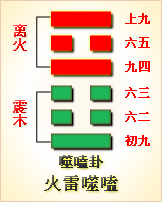

---
hide:
  - navigation
---
# 周易第21卦_噬嗑卦(火雷噬嗑)_离上震下 

<table>
	<tbody>
		<tr>
			<td class="td1">
				</td>
			<td class="td1">
				</td>
			<td class="td1">
				</td>
			<td class="td1">
				</td>
		</tr>
		<tr>
			<td style="text-align: center;">
				<strong>本卦</strong></td>
			<td style="text-align: center;">
				<strong>互卦</strong></td>
			<td style="text-align: center;">
				<strong>错卦</strong></td>
			<td style="text-align: center;">
				<strong>综卦</strong></td>
		</tr>
		<tr>
			<td style="text-align: center;">
				<a href="" style="text-decoration: none;">第21卦：噬嗑卦(火雷噬嗑)</a></td>
			<td style="text-align: center;">
				<a href="../39.水山蹇" style="text-decoration: none;">第39卦：蹇卦(水山蹇)</a></td>
			<td style="text-align: center;">
				<a href="../48.水风井" style="text-decoration: none;">第48卦：井卦(水风井)</a></td>
			<td style="text-align: center;">
				<a href="../22.山火贲" style="text-decoration: none;">第22卦：贲卦(山火贲)</a></td>
		</tr>
	</tbody>
</table>

## 周易第二十一卦详解

**噬嗑卦原文**

噬嗑。亨。利用狱。

象曰：雷电噬嗑。先王以明罚敕法。

**白话文解释**

噬瞌卦：通泰。利于讼狱。

《象辞》说：本卦下卦为震为雷，上卦为离为电，雷电交合是噬嗑的卦象。先王观此卦象，取法于威风凛凛的雷、照彻幽隐的电，思以严明治政，从而明察其刑罚，修正其法律。

**《断易天机》解**

噬嗑卦离上震下，为巽宫五世卦。噬嗑为咬合之意，象征物品咬碎之后才能通过。此卦于诉讼有利。

**北宋易学家邵雍解**

咬碎硬骨，强硬态度；事多困阻，积极谋求。

得此卦者，事不遂心，纷争难免，诸事被阻，宜坚守常规，不为利诱，可保平安。

台湾国学大儒傅佩荣解

时运：好运初动，声名直上。

财运：买卖皆成，货物畅销。

家宅：小心火灾；百年好合。

身体：须防郁热，失物不保。

**传统解卦**

这个卦是异卦（下震上离）相叠。离为阴卦；震为阳卦。阴阳相交，咬碎硬物，喻恩威并施，宽严结合，刚柔相济。噬嗑为上下颚咬合，咀嚼。

大象：上唇与下唇间有物，必须咬断，方能合拢，乃诸事被阻，务必去除，方可成功。

运势：诸事阻隔，纷争难免，宜守常规，不为利诱，问题可解决。

事业：困难与阻力非常大，应以坚强的意志，果敢的行为，公正无私的态度去战胜种种厄运，争取事态好转。为了早日化险为夷，必要时可采取强硬手段，甚至诉诸法律。

经商：处于不利的时候，头脑冷静，明察形势，寻求机遇，不为眼前小利所诱，不发非分之财。认真听取忠告，遵守法纪，秉公办事，不得徇私情，更警惕不得触犯刑律。

求名：自己的努力尚不为人所知，不可急于求成，受到挫折应看作是对自己的考验，持之以恒，必能成功。

婚恋：初不顺利，须有顽强精神可以取得满意的结果，不可以个人的情绪左右家庭事务。

决策：一生不平坦，会遇到挫折和磨难，但应看作是对个人的考验，应认真总结经验教训，以更为坚强的意志，不屈不挠，继续前进。经过锻炼，各方面都会有较大的进展，终将进入光明境地，取得重大成就。

**第二十一卦的哲学含义**

噬嗑卦卦象，火雷噬嗑卦的象征意义

火雷噬嗑，这个卦是异卦相叠，下卦为震，上卦为离。离为阴卦，震为阳卦。阴阳相交，咬碎硬物，喻恩威并施，宽严结合，刚柔相济。

噬嗑，噬，是指咬。嗑，同“合”。噬嗑，为上下颚咬合，咀嚼。合住嘴巴把嘴中之物咬住不放或吃掉。

火雷噬嗑以卦形来看，初九和上九像一个人的上下嘴唇；六二、六三和六五，像人的上下两排牙齿；而九四，正好像口内所含之物，被上下牙咬住不放，犹如一个进入监狱似的，那是无法跑掉的，因此又可象征监狱。

从监狱的角度来分析卦形，初九和上九，好像厚实的狱墙。而墙内的六二、六三、六五，又像软弱的犯人，而九四正好像强悍的狱官或巡狱者。

《象》中这样解释本卦：雷电，噬磕；先王以明罚赤法。

《象》中指出：噬嗑卦的卦象是震（雷）下离（火）上，为雷电交击之表象。雷电交击，就像咬合一样；雷有威慑力，电能放光明，古代帝王效法这一现象，明其刑法，正其法令。

噬嗑卦启示了刚柔相济的道理，属于上上卦。《象》中对此卦的断语是：运拙如同身受饥，幸得送饭又送食，适口充腹心欢喜，忧愁从此渐消移。

火雷噬嗑从卦象上分析，噬嗑卦上卦为离为火为电，下卦为震为木为雷，闪电雷卦上卦为离为火为电，卦为震为木为雷，闪电雷鸣，击中物体使其燃烧起来，这就是噬嗑卦的卦象。下雷阵雨时，一些建筑物遭受雷击会倒塌，一些动物与人遭受雷击会死亡，森林遭受雷击会发生火灾。古人看到这个自然现象，认为是天神在惩罚罪恶。君王效法天神的做法，所以也像雷电击中物体一样打击犯罪分子。雷电是迅猛的，所以也表示打击犯罪要迅捷，要彻底，力度要狠。

## 周易第二十一卦初九爻详解

**初九爻辞**

初九。屦校灭趾，无咎。

象曰：屦校灭趾，不行也。

**白话文解释**

初九：拖着刑具，磨破了脚趾，但没有大的灾难。

《象辞》说：拖着刑具，磨破了脚趾，小惩则可大戒，使之不重犯过错。

**北宋易学家邵雍解**

凶：得此爻者，宜谨慎行事，以免生祸端。做官的会遭到贬职。

台湾国学大儒傅佩荣解

时运：须防小灾，慎免大患。

财运：谨慎交易，避开木业。

家宅：兴工改造；婚嫁不宜。

身体：足病初发，宜早医治。

**初九变卦**

初九爻动变得周易第35卦：火地晋。这个卦是异卦（下坤上离）相叠。离为日，为光明；坤为地。太阳高悬，普照大地，大地卑顺，万物生长，光明磊落，柔进上行，喻事业蒸蒸日上。

**初九爻的哲学含义**

噬嗑卦第一爻，爻辞：初九：屦校灭趾，无咎。爻辞释义

屦：指贯穿。校：木制刑具，指约束。灭：指遮没覆盖到看不见程度。趾脚趾，这里指限制活动。本爻的意思是：戴上脚枷，遮住脚趾，没有灾难。

从卦象上看，初九为阳爻，阳爻居刚位，其位居于下卦震之始，上与九四敌应，有率众闹事、不服管束、图谋不轨的行为。对于这类不守规矩的小人，要加以警戒和防范。

《象》曰：“屦校灭趾”，不行也。

## 周易第二十一卦九二爻详解

**六二爻辞**

六二。噬肤灭鼻，无咎。

象曰：噬肤灭鼻，乘刚也。

**白话文解释**

六二：大吃鲜鱼嫩肉，遭受割鼻之刑，但没有大难。

《象辞》说：大吃鲜鱼嫩肉，遭受割鼻之刑，因为六二之爻居于阳爻之上，像人享受非分之福。

**北宋易学家邵雍解**

平：得此爻者，进退艰难，是非不断，或生暗疾，骨肉有伤。做官的不会顺利，会有所纠结。

台湾国学大儒傅佩荣解

时运：才力尚浅，须借人助。

财运：暂时保存，待价出手。

家宅：老宅不利；婚嫁兴家。

身体：肌肤有病，小心深入。

**六二变卦**

六二爻动变得周易第38卦：火泽睽。这个卦是异卦（下兑上离）相叠。离为火；兑为泽。上火下泽，相违不相济。克则生，往复无空。万物有所不同，必有所异，相互矛盾。睽即矛盾。

**九二爻的哲学含义**

噬嗑卦第二爻，爻辞：六二：噬肤灭鼻，无咎。爻辞释义

肤：指连着皮的肥肉。

本爻的意思是：咬食肥肉，鼻子没入，没有灾难。经文意思是：咬肉吃，鼻子陷入肉中，六二身为大夫之位，吃肉时太贪婪了，竟然把鼻子陷到了肉里面。这么吃东-西肯定是显得很不文明。不过只是形象问题，没有什么大的过失，所以没有灾难。由于六二凌驾于初九之上，所以有乘刚的形象。一般来讲，阴乘刚指女夺夫权。这个六二身居偶位为得位，又能够居中，可见还是有道德的。可是其乘驾于初九之上，所以爻辞中描写的吃肉的“贪”，实际上是暗示六二对初九之“贪”。也就是说六二太想控制住初九了。

从卦象上看，六二处于互艮之中，艮是指六二与九四互为艮卦。艮卦是一阳爻在外，二阴爻在内，阳爻是外面的皮，阴爻是皮下的肥肉。艮又为鼻，为黑嘴头动物。肤为带皮的肉、软肉、鲜肉。所以一咬，鼻子就陷下去。人如果这样吃饭，这种吃相很不讲究，很不雅，由此指人在做事时不择手段，不注意方式。

六二这一爻属于阴爻居柔位，虽然得位居中，但是与全卦之中的君爻六五敌应。与一卦之中的最高领导失和，会导致其自身发展不顺，心中怀有怨气，所以在做事时不太注意方式方法。但是由于他凌驾于初九之上，有如是一个施刑之人一样，所以没有灾难。

占得此爻者，你可能对自己的职务或者地位不满，觉得自己不顺，有时就乱发脾气。要注意一下自己说话做事的方式，不要身边有人犯了错误，就大加惩罚，或横加训斥，破口大骂，吹胡子瞪眼，这样有损自己的形象，还起不到教育的作用。要知道，批评是一种艺术，有时你如果想责备某个人时，从效果的角度考虑，不如改为规劝，关切的话题更能深入人心

## 周易第二十一卦九三爻详解详解

**六三爻辞**

六三。噬腊肉，遇毒。小吝，无咎。

象曰：遇毒，位不当也。

**白话文解释**

六三：吃腊肉，中毒。碰上了麻烦，但不十分严重。

《象辞》说：中毒，因为六三阴爻居于阳位，像人不称其位。

**北宋易学家邵雍解**

凶：得此爻者，不易成事，运气不顺，或生心腹之疾，或有惊险。做官的才力不及，有失。

台湾国学大儒傅佩荣解

时运：气运不佳，反遭人怨。

财运：处置不当，反受损失。

家宅：小有不安。

身体：药不对症，幸无大碍。

**六三变卦**

六三爻动变得周易第30卦：离为火。这个卦是同卦（下离上离）相叠。离者丽也，附着之意，一阴附丽，上下二阳，该卦象征火，内空外明。离为火、为明，太阳反复升落，运行不息，柔顺为心。

**九三爻的哲学含义**

噬嗑卦第三爻，爻辞：六三：噬腊肉，遇毒；小吝，无咎。爻辞释义

腊肉：是指肉经腌制后再经过烘烤（或日光下曝晒）的过程所制成的加工品，比鲜肉难咀嚼。在这里喻指事情的难度有所增加。

本爻的意思是：咬食腊肉，遇到有毒的部分。有小的困难，没有灾难。经文意思是：咬腊肉干，却中了毒，小有不顺，没有灾难。六三爻柔爻居于奇位，是不得位，并且又不得中，正好是噬嗑卦上互卦坎卦的下爻，坎为毒，所以有“遇毒”之象。但六三爻又是下互卦艮卦的中爻，遇险而止，所以中毒不深，不会有大的灾难，只是有些小小的忧吝。按现在的话来说就是，吃了发霉的腊肉，及早发现口味不对，没有再往下吃，所以不会对身体造成伤害。

这一爻给人的警示是：追求现实的利益犹如嗑咬有毒的腊肉，很危险，但小心从事，还是可以的。

六三虽在艮卦中，但比六二接近上卦离，离为火，肉发干，故为腊肉。同时，六三、九四、六五组成了坎卦，坎为毒，在这里比喻对现实利益追求的危险

性。

六三以阴爻居刚位，本身位不当，就像不具有施刑的资格，却给别人施刑一样，在实施的过程中像咀嚼坚硬的腊肉一样不顺利，同时还招来了怨毒的反应。

占得此爻者，可能在工作中遇到了难以解决的困难，所以应该小心，以免受到伤害。因为六三阳爻居刚位，有越权或违规之象，所以要检查一下自己的行为是否越权，是否超越了法律和权力的界限。

## 周易第二十一卦九四爻详解详解

**九四爻辞**

九四。噬干胏，得金矢。利艰贞，吉。

象曰：利艰贞吉，未光也。

**白话文解释**

九四：啃吃骨头，发现骨头中有金属箭头。卜问艰难之事，结果是吉利的。

《象辞》说：卜问艰难之事，结果是吉利的，但目前仍处于艰难之中，尚未进入光明之境。

**北宋易学家邵雍解**

吉：得此爻者，经商必获利。做官的会升迁，读书人会成名。

台湾国学大儒傅佩荣解

时运：改旧促新，万事皆吉。

财运：小本大利，自然可喜。

家宅：保家有道；婚嫁勤俭。

身体：难治之症，宜多调养。

**九四变卦**

九四爻动变得周易第27卦：山雷颐。这个卦是异卦（下震上艮）相叠。震为雷，艮为山。山在上而雷在下，外实内虚。春暖万物养育，依时养贤育民。阳实阴虚，实者养人，虚者为人养。自食其力。

**九四爻的哲学含义**

噬嗑第四爻，爻辞：九四：噬干胏，得金矢；利艰贞，吉。爻辞释义

干胏：这里指带骨头的干肉。金矢：指金属箭头。

本爻的意思是：咬食带骨头的干肉，得到了金属箭头。有利于在艰难中坚守正道，其结果是吉利的。

经文意思是：吃骨头上的干肉，得到铜箭头，利于在艰难中持守正道，吉祥。象辞意思是：在艰难中守正道，是因为还没有进入光明的境地。

九四爻在噬嗑卦中，就相当于口中所咬的硬物，就像一根骨头，所以爻辞中时更是指骨头上的干肉。

从卦象上看，九四属于阳爻居于柔位，具有刚健、勇猛的特征，也有谦卑柔顺的品质，可以说是刚柔相济。九四属于近君大臣，但是君位上的是六五，属于阴爻居于君位，才质柔弱，对九四有很大的依赖性，治国的大部分重任、硬骨头，要由九四来负责。九四处于互坎〔六三、九四、六五）中，坎代表着艰难险阻。九四要靠坚守正道来战胜艰险，虽然很难，但是会有意外的收获。古代的肉都是射杀动物得来的，可能射杀时金属箭头留在了上面。九四会有意外的收获，就有如在吃肉时，得到了金属的箭头一样。

本爻给人的启示是，在艰难的处境之中，只要你内心正直，意志坚强，努力去克服困难，虽然这种“带骨头的干肉”很难啃，但是你要不放弃，坚持去做，会有所收获的。

古代人们经常可以吃到打猎的野味，所以从肉中吃出箭头本是一件平常的事情。不过在这里是指有意外的收获。也就是说在艰苦的生活中能够坚守正道，会获得吉祥。

## 周易第二十一卦九五爻详解详解

**六五爻辞**

六五。噬干肉，得黄金。贞厉，无咎。

象曰：贞厉无咎，得当也。

**白话文解释**

六五：吃干肉，发现金属箭头。卜问得危险之兆，但最终可以无灾祸。

《象辞》说：卜问得危险之兆，但最终可以无灾祸，因为六五之爻居上卦中位，位象得当，可以化险为夷。

**北宋易学家邵雍解**

吉：得此爻者，行好运，有病的会痊愈，有冤的会昭雪，读书人进取成名，做官的会剪除小人。

台湾国学大儒傅佩荣解

时运：正当行运，无不如意。

财运：上品货物，自然得利。

家宅：方位合宜。

身体：忌食肉类，小心调养。

**六五变卦**

六五爻动变得周易第25卦：天雷无妄。这个卦是异卦（下震上乾）相叠。乾为天为刚为健；震为雷为刚为动。动而健，刚阳盛，人心振奋，必有所得，但唯循纯正，不可妄行。无妄必有获，必可致福。

**九五爻的哲学含义**

噬嗑第五爻，爻辞：六五，噬干肉，得黄金；贞厉，无咎。爻辞释义

本爻的意思是：咬食干肉，获得黄金。只要坚守正道，虽有危险，但没有灾。

象辞意思是：守正道没有灾难，是因为六五所处的位置得当。

身为九五之尊的天子也吃肉干，说明能够与天下臣民共同节俭，能够这样简朴地生活，自然国库就充实，所以“得黄金”。鲜肉不吃而吃肉干，这说明节省。为什么这么说呢？因为在远古时代，人们是以鲜肉为美的，一般是捕杀到猎物后便进行烹煮食用。可是后来，捕获的猎物多了，吃不了，便有剩下的余肉。这些肉有的腐烂掉了，有的被风吹干还可以食用。于是人类逐渐掌握了保存鲜肉的技术。一个君王以身作则，饮食节俭，自然会使百姓也跟着节俭起

来。这样社会财富才能得到积蓄。这其实是盛世中极其重要的一种治理手段。

爻辞：六五，噬干肉，得黄金；贞厉，无咎。人生启示

从卦象上看，六五以柔爻居于刚位，刚柔相济。又居于中位，能持守中道。

其所面临的困难更大了，已经不是“肥肉”“腊肉”了，而是“干肉”了。在这种情况下，六五能坚守正道，去克服困难，坚决地除掉奸佞，获得了他人的信服。六五常怀危惧之心，防患于未然，这样自然就减少了灾祸，而且得到了意外的收获。

占得此爻者，应该学习九五的这种精神，虽然身处险阻之中，也可以顺利渡。

## 周易第二十一卦上九爻详解详解

**上九爻辞**

上九。何校灭耳，凶。

象曰：何校灭耳，聪不明也。

**白话文解释**

上九：肩上扛着大枷，磨破了耳朵，凶险。

《象辞》说：肩上杠着大枷，磨破了耳朵，因为其人不听劝阻，触犯了刑律。

**北宋易学家邵雍解**

凶：得此爻者，须防争诉，不良者，耳目不明，血气不顺，或有生命之忧。做官的须防止小人的谗言而遭致贬职。

台湾国学大儒傅佩荣解

时运：柔和处世，可保无虞。

财运：得利即止，可无大损。

家宅：须防意外。

身体：眼耳之疾；保养头部。

**上九变卦**

上九爻动变得周易第51卦：震为雷。这个卦是同卦（下震上震）相叠。震为雷，两震相叠，反响巨大，可消除沉闷之气，亨通畅达。平日应居安思危，怀恐惧心理，不敢有所怠慢，遇到突发事变，也能安然自若，谈笑如常。

**上九爻的哲学含义**

噬嗑第六爻，爻辞：上九：何校灭耳，凶。爻辞释义

何：为“荷”，担负之意。校：木制刑具，指约束。灭：指遮住。

本爻的意思是：肩负重枷，遮住耳朵，有凶险。

经文意思是：带着枷锁，遮住了耳朵，凶险。

上九肩上杠着沉重的大枷锁，这是为了给众人看的，让众人引以为戒，不要像这个人一样犯法。只有重刑犯才会戴枷锁，戴上枷锁主要是为了警示后人，而不是为了让犯人改正，因为这种犯人示众之后就该斩首了，所以凶险。这个上九怎么会得到这样的下场呢？象辞给出了答案：“聪不明也。”也就是说这个人耳不聪、眼不明，所以导致现在的下场。他为什么眼不明？因为他没有看到当前的形势。当前的形势正在惩治坏人坏事，奖励好人好事，结果他继续从事罪恶活动，结果罪过越来越大，走到了今天。他虽然长着耳朵，但是却没有大用处。所以顽固不化，最终犯了大罪，被戴上枷锁，游街示众，午门问斩，成为儆示民众守法的典型。

上九：何校灭耳，凶。人生启示

《象》曰：“何校灭耳”，聪不明也。

这指出了为何从初九的“屦校”到了“何校”，枷锁在脚上到了在肩上，严重程度已到极点，是“聪不明也”，这是因为不听劝告，不能改恶从善，太不聪明了，结果受了这样的重刑。

从卦象上看，上九居离卦终位，又在互坎〔六三、九四、六五）之上，而离代表目，坎代表耳，由此可见遮住了耳目。自己不聪不明，不听劝告，所以才使得刑具在肩。

占得此爻者，如果你在做事时，有朋友来劝谏，而你听不进朋友的忠告，一意孤行，去做没有把握的事，你将很快陷入内外交困的处境。