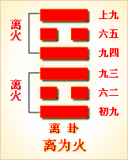

---
hide:
  - navigation
---
# 周易第30卦_离卦(离为火)_离上离下 

<table>
	<tbody>
		<tr>
			<td class="td1">
				</td>
			<td class="td1">
				</td>
			<td class="td1">
				</td>
			<td class="td1">
				</td>
		</tr>
		<tr>
			<td style="text-align: center;">
				<strong>本卦</strong></td>
			<td style="text-align: center;">
				<strong>互卦</strong></td>
			<td style="text-align: center;">
				<strong>错卦</strong></td>
			<td style="text-align: center;">
				<strong>综卦</strong></td>
		</tr>
		<tr>
			<td style="text-align: center;">
				<a href="" style="text-decoration: none;">第30卦：离卦(离为火)</a></td>
			<td style="text-align: center;">
				<a href="../28.泽风大过" style="text-decoration: none;">第28卦：大过卦(泽风大过)</a></td>
			<td style="text-align: center;">
				<a href="../29.坎为水" style="text-decoration: none;">第29卦：坎卦(坎为水)</a></td>
			<td style="text-align: center;">
				<a href="" style="text-decoration: none;">第30卦：离卦(离为火)</a></td>
		</tr>
	</tbody>
</table>

## 周易第三十卦详解

**离卦原文**

离。利贞，亨。畜牝牛，吉。

象曰：明两作，离。大人以继明照四方。

**白话文解释**

离卦：吉利的占问，通泰。饲养母牛，吉利。

《象辞》说：今朝太阳升，明朝太阳升，相继不停顿，这是离卦的卦象。贵族王公观此卦象，从而以源源不断的光明照临四方。

**《断易天机》解**

离卦离上离下，为离宫本位卦。离可取光明、美丽、离散之意，利文章而不利出师。

**北宋易学家邵雍解**

附丽光明，谦虚缓进；公正柔和，顺守则吉。

得此卦者，宜谦虚谨慎，稳步进取，则前途光明。急进及意气用事者必有所损失。

台湾国学大儒傅佩荣解

时运：努力修德，前途光明。

财运：与火有关，皆有所得。

家宅：贵人之屋；可得继室。

身体：热病严重，小心大去。

**传统解卦**

这个卦是同卦（下离上离）相叠。离者丽也，附着之意，一阴附丽，上下二阳，该卦象征火，内空外明。离为火、为明，太阳反复升落，运行不息，柔顺为心。

大象：两离火相重，上下通明之象，火有气，但无形，主不实不定之意。

运势：外观极盛，烈日当空之象，凡事不宜急进及意气用事。

事业：已快进入顶点，盛极而衰，务必总结经验教训，趋善避邪，以顺自养，居危知危，激励志气，切勿妄动。尤应求助中正的人援助，以期重振事业。

经商：不要急于求成，宜兢兢业业，忧深虑远，考察市场行情，公平竞争，不可投机取巧，争取与他人密切合作。

求名：方向未确定之前，不可到处乱撞，应持之以恒，执意追求，虚心向有才德的长者请教。

婚恋：自己寻找对象恐怕有困难，最好请可靠的朋友、长辈帮忙，不得急躁。双方应相互尊敬，最忌生邪念。

决策：乐天知命，顺应自然，年轻时急于上进，未能实现理想，但坚持中正、谦和，可无灾祸，时常警觉，更可化险为夷。在危难时要寻求依托，但要慎重选择对象。晚年应知天命，尤不可不顾时势而轻举妄图动。

**第三十卦的哲学含义**

离为火，《易经》中离卦的符号为。八卦中离卦的符号的产生，是古人遥望远方，见在土地上燃起熊熊的烈火，于是用阳性符号“一”画出地块，用阴性符号“一”画出火苗。离卦是上下是阳爻，中间是阴爻，看上去像是燃烧的火苗，这一卦就象征火。

离卦一阴爻居中，二阳爻在外，为外刚内柔，外硬内软之性情，有由中心向外发展的趋势，有离散之象。一切鳖、蟹、龟、贝类，士兵的衣甲胄帽等等外刚内柔之物均归类于离卦。

离卦还具有如下象意明、进升、依附、华丽、鲜艳、文明、礼仪、明察、磊落、发现、扩张、漫延、外强、中干、焦躁、煽动、排斥、抗拒、否定、批判、流行、检举、侦察、轻浮、显示、自满、花言巧语、抗上、撒谎、干枯、枯燥、空虚等。

六十四卦之中的离卦是八卦中的离卦相叠，符号为“”。离卦象征的意义是附着。《序卦传》说：“陷必有所丽，故受之以离；离者丽也。”离卦的上卦是坎，意思是陷入坎里肯定会附着在一个地方上，所以在坎卦之后接着是离卦。

《象》是这样分析离卦的：明两作，离；大人以继明照于四方。

《象》中指出离卦的卦象为光明接连升起之表象。离卦在这里代表太阳。太阳东升西落，因而有上下充满光明的形象。太阳的光明连续照耀，必须高悬依附在天空才行，所以象征附着；伟大的人物效法这一现象，也应当连绵不断地用太阳般的光明美德普照四方。

离卦给人的启示是就附着依托，属于中上卦。《象》中这样来断此卦：官人来占主高升，庄农人家产业增，生意买卖利息厚，匠艺占之大亨通。

## 周易第三十卦初九爻详解

**初九爻辞**

初九。履错然，敬之，无咎。

象曰：履错之敬，以辟咎也。

**白话文解释**

初九：听到纷来沓至的脚步声，立时警惕戒备，可以无灾难。

《象辞》说：听到纷至沓来的脚步声，立时警惕戒备，可以避免灾难。

**北宋易学家邵雍解**

平：得此爻者，须防无妄之灾，宜谨慎，或有足疾。做官的宜安守。

台湾国学大儒傅佩荣解

时运：临事而惧，得助而成。

财运：暂无大利，但可无咎。

家宅：大道之旁。

身体：走路小心。

**初九变卦**

初九爻动变得周易第56卦：火山旅。这个卦是异卦（下艮上离）相叠。此卦与丰卦相反，互为“综卦”。山中燃火，烧而不止，火势不停地向前蔓延，如同途中行人，急于赶路。因而称旅卦。

**初九爻的哲学含义**

离卦第一爻，爻辞：初九：履错然，敬之，无咎。爻辞释义

履：指鞋子，步履，有行走之意。错然：是指错乱的样子。

本爻辞的意思是：步子错乱，但保持恭敬谨慎，就没有过错。

从卦象上看，初九这一爻是阳爻居刚位，有阳刚、健行、积极主动的特点。位于初九，表示事情刚开始，有急于求成的特点。若是在做事的初始，方向未定，就争于上进，可能就会横冲直撞，脚步错乱，有陷入危险的可能。本爻是对此提出警告，要求必须谨慎，不可妄动。

《象》曰：“履错之敬”，以辟咎也。这就是告诫人们，在开始行事时，由于急于求成而出现错乱，但是发现后，一定要变得恭敬慎重，不要轻举妄动，这样做主要是为了避免灾祸的发生。

占得此卦者，如果自己缺乏确定的目标，又步履错乱，那有可能被引向错误的方向。所以要通过自我反省，确定好目标和方向之后，再以恭敬慎重的态度来行事，这样才能没有过错。

初九这一爻，说明依附前应先认清对象。不管依附的对象是公司、老板、朋友、目标、理想，都不要急于冒进，而是要谨慎恭敬，认清之后再行事。

占得此爻者，可能在待人接物的礼节上搞错了，出了一些问题，甚至闹出了笑话。这时可以向对方诚挚地道歉，再送一点礼物，这样对方就不会怪罪于你了。若是参加典礼，在典礼上做事要谨慎严肃，这样就不会犯错了。

## 周易第三十卦九二爻详解

**六二爻辞**

六二。黄离，元吉。

象曰：黄离元吉，得中道也。

**白话文解释**

六二：天空出黄霓，大吉大利。

《象辞》说：黄色附丽于身，大吉大利，因为六二之爻居下卦中位，像人得中正之道。

**北宋易学家邵雍解**

吉：得此爻者，财利可获。做官的会受到重用。读书人会取得佳绩。

台湾国学大儒傅佩荣解

时运：文明在外，功名必显。

财运：利在土木，中规中矩。

家宅：振起家声；可成佳偶。

身体：郁热之症。

**六二变卦**

六二爻动变得周易第14卦：火天大有。这个卦是异卦（下乾上离）相叠。上卦为离，为火；下卦为乾，为天。火在天上，普照万物，万民归顺，顺天依时，大有所成。

**九二爻的哲学含义**

离卦第二爻，爻辞：六二：黄离，元吉。爻辞释义

本爻辞的意思是：附着在黄色上，

二这一爻，强调的是依附应本着中正的原则《象》中这样分析本爻：“黄离元吉”，得中道也。这里指出，“附着在黄色上，大吉大利”，是因为黄色代表中，坚守正道，可以获得大吉大利。

古人以五行配合方位及颜色：木在东方，为青色；火在南方，为红色；金在西方，为白色；水在北方，为黑色；土在中间，为黄色。黄色居中，六二这一交在内卦的中位，因而附着于中色；六二又属于阴爻居阴位，得位，符合阴爻特点，具备中正的德性，所以结果大吉大利。

占得此爻者，要注意在与人交往之时，要遵守中庸之道，不要走极端，这样才会受到各方面人物的欢迎，做事才会顺利。

## 周易第三十卦九三爻详解详解

**九三爻辞**

九三。日昃之离。不鼓缶而歌，则大耋之嗟，凶。

象曰：日昃之离，何可久也。

**白话文解释**

九三：黄昏时分有霓虹出现在天空，这是凶兆，人们居然不击鼓唱歌禳除它，老人感到悲哀，灾殃快要来了。

《象辞》说：黄昏时分的霓虹，怎么会长留不散。

**北宋易学家邵雍解**

凶：得此爻者，乐中生悲，吉中生愁，险难迭生。做官的告休。

台湾国学大儒傅佩荣解

时运：老大无成，心思涣散。

财运：留连夜市，必伤正业。

家宅：老人不安；难望偕老。

身体：早睡早起。

**九三变卦**

九三爻动变得周易第21卦：火雷噬嗑。这个卦是异卦（下震上离）相叠。离为阴卦；震为阳卦。阴阳相交，咬碎硬物，喻恩威并施，宽严结合，刚柔相济。噬嗑为上下颚咬合，咀嚼。

**九三爻的哲学含义**

离卦第三爻，爻辞：九三：日昃之离，不鼓缶而歌，则大耋之嗟，凶。爻辞释义

日昃：指太阳西斜将落。鼓缶：指敲着瓦盆。耋:是指八十岁老人。嗟：是指嗟叹。

本爻辞的意思是：夕阳西下，这时如果不能敲着瓦盆高歌，就会发出垂老之人的哀叹，有凶险。

占得此爻者，应该保持谨慎的做事态度，有居安思危的意识。同时还要知道，生死是自然的常理，应当秘知命。

因为太阳当顶就要开始西斜，事业处在顶峰时就会开始走向衰落，对此要有

足够的认识，同时还要有豁达的心态来接受这一切，就像必须接受人会从年轻到老年一样，进入了风烛残年，也要敲着酒坛高歌，欢度余年，乐天知命；否则，就难免自怨自爻，徒然悲伤了。

占得此爻者，还意味着你想依附的对象，时间不能长久：或者你去了一个处于下坡路的公司，或者依附了一个老人。

《象》对此爻的分析是：“日昃之离”，何可久也！这里指出：太阳偏西即将落下，人步入老年了，即将死去，怎么能长久呢！

占得此爻者，在找工作或寻找依附对象时，一定要考察一下对方的情况才可行动。

## 周易第三十卦九四爻详解详解

**九四爻辞**

九四。突如其来如，焚如，死如，弃如。

象曰：突如其来如，无所容也。

**白话文解释**

九四：灾难突然降临，敌人见房屋就烧，见人就杀，此处变成一片废墟。

《象辞》说：灾难来得如此突然，人们无处藏身逃命。

**北宋易学家邵雍解**

凶：得此爻者，时运不济，困难重重，或和长辈不睦，或遭官灾。

台湾国学大儒傅佩荣解

时运：为免灾祸，不如隐退。

财运：人财两亡，小心避开。

家宅：逆子之罪；婚姻不吉。

身体：命在危局。

**九四变卦**

九四爻动变得周易第22卦：山火贲。这个卦是异卦（下离上艮）相叠。离为火为明；艮为山为止。文明而有节制。贲卦论述文与质的关系，以质为主，以文调节。贲，文饰、修饰。

**九四爻的哲学含义**

离卦第四爻，爻辞：九四：突如其来如，焚如，死如，弃如。爻辞释义

如：相当于“然”，结构助词，意思是某种样子或状态。焚：是指燃烧。弃：是指抛弃。

本爻辞的意思是：突然而来，如同火焰熊熊燃烧，会有生命危险，会被抛弃。

九四这一爻告诉人们，在寻找依附之时，不可以乘人之危，不能采取胁迫的手段。

从卦象上看，九四属于阳爻居阴位，有处事鲁莽、急进之象。此爻紧临六五之君主之位，有如近君大臣一样，但是，这位大臣不归顺于六五这一君主，甚至会压迫阴柔的君主。这一爻的情景，有如原来君主突然离世，本来应该由早就定好的储君继位。可是这位近君大臣却想谋权篡位。

《象》中这样分析这一爻：“突如其来如”，无所容也。

这里指出，“突然而来，如同火焰熊熊燃烧”，这种刚烈暴躁的气焰，必然带来危险，是天下人所不能容忍的。

爻辞中的“焚如，死如，弃如”，都是描述六四的样子，“焚如”是指其灼热、暴躁有如火焚；“死如”是指其大祸临头至于丧命，“弃如”是指其名誉被毁，遭人唾弃。

六四这一爻结果很遭，原因是没有守正道。占得此爻者要注意，不要趁人之危去获取利益，也不要采取胁迫的手段，为自己谋取职位或晋升等，一定要注意，坚守正道，才能吉利。

## 周易第三十卦九五爻详解详解

**六五爻辞**

六五。出涕沱若，戚嗟若，吉。

象曰：六五之吉，离王公也。

**白话文解释**

六五：灾难过后，人们痛哭，人们悲叹，然而吉利。

《象辞》说：**六五爻辞**所讲的吉利，因为爻象表明，六五之爻处于上九之下，像人们能够附丽于王公而得救。

**北宋易学家邵雍解**

平：得此爻者，不宜进取，宜守常。做官的在位者得志，退职者多险危。

台湾国学大儒傅佩荣解

时运：位高权重，慎谋能断。

财运：辛苦经营，公家生意。

家宅：婚事主贵；先泣后笑。

身体：又哭又叹，但仍无妨。

**六五变卦**

六五爻动变得周易第13卦：天火同人。这个卦是异卦（下离上乾）相叠，乾为天，为君；离为火，为臣民百姓，上天下火，火性上升，同于天，上下和同，同舟共济，人际关系和谐，天下大同。

**九五爻的哲学含义**

离卦第五爻，爻辞：六五：出涕佗若，戚嗟若，吉。爻辞释义

涕：是指眼泪。沱：是指水涌出。若：同“如”，像某种样子、状态。戚：

从卦象上看，六五爻属于阴爻居刚位，性情柔弱，位不正，被上下两个阳爻逼迫，下面近君大臣对其不服，上面退休人士或在野贤人对其不忿，所以会处于忧惧之中，以致流泪叹息。幸运的是，六五处于君主之位，虽然处境危险，但是由于日夜忧惧，而时刻警觉，反而能化险为夷，所以吉祥。

占得此爻者，可能刚从险境中摆脱出来，在流泪庆幸之余，还应该马上去寻求有权势、有影响的大人物的保护。也可能遇到了灾难，经过了泪如泉涌，悲伤叹息的阶段，亲戚朋友都跟着忧愁，好在灾难已过，结果还是吉祥的。

## 周易第三十卦上九爻详解详解

**上九爻辞**

上九。王用出征，有嘉。折首，获匪其丑，无咎。

象曰：王用出征，以正邦也。

**白话文解释**

上九：国王出征，反击敌人，将有嘉国的国君斩首，抓到了许多俘虏，无灾无难。

《象辞》说：君王出兵反击，以安定邦国。抓到了许多俘虏，是说大获胜仗。

**北宋易学家邵雍解**

吉：得此爻者，时运佳，多喜事，经营获利。做官的会功成名就，读书人会取得好成绩。

台湾国学大儒傅佩荣解

时运：与人为善，必受重用。

财运：上等货品，才可获利。

家宅：旅行在外。

身体：可能归天。

**上九变卦**

上九爻动变得周易第55卦：雷火丰。这个卦是异卦（下离上震）相叠，电闪雷鸣，成就巨大，喻达到顶峰，如日中天。告戒：务必注意事物向相反方面发展，盛衰无常，不可不警惕。

**上九爻的哲学含义**

离卦第六爻，爻辞：上九：王用出征，有嘉折首，获匪其丑，无咎。爻辞释义

嘉：指嘉奖。折首：指催折敌人首领者。匪：同“非”，反对，不要之意。丑：小丑，胁从者。

本爻辞的意思是：君王用贤人出兵征伐，对能够斩杀敌方首领的给予嘉奖，不捕获一般的随从，没有灾难。

从卦象上看，上九已是这一卦最高点，离卦代表光明，上九爻可以说是光明的极点，位置高，能够明察到全国的每一角落。而且上九属于阳爻，阳刚果断，可以用兵，诛杀恶人。但是，在征伐的过程中，也要守持正道，不滥杀无辜，只斩杀首脑，而放过随从者，所以无咎。这一爻，说明邪恶应当排除，但只杀首恶，不究附从。

《象》中分析此爻道：“王用出征”，以正邦也。这里指出，出兵征伐是为了治理国家，并非是为了耀武扬威，滥杀无辜。所以，进行正义的战争，就不会发生灾祸。